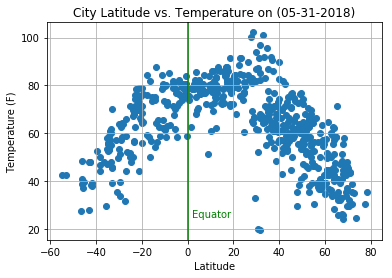
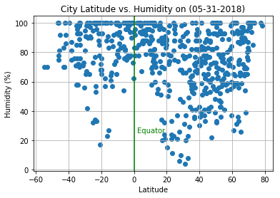
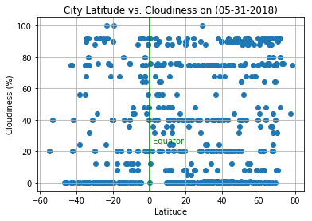
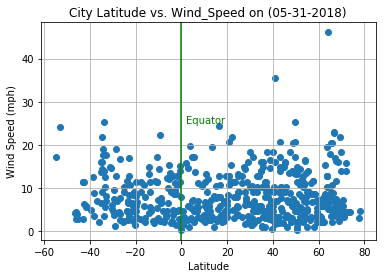

# WeatherPy

### Background:
LATITUDE:
Lines of latitude measure north --> south position between the poles. 
The equator is defined as 0 degrees, the North Pole is 90 degrees north, and the South Pole is 90 degrees south.
Lines of latitude are all parallel to each other, thus they are often referred to as parallels.

LONGITUDE:
Lines of longitude, or meridians, run between the North and South Poles. They measure east --> west position.
The prime meridian is assigned the value of 0 degrees, and runs through Greenwich, England.
Meridians to the west of the prime meridian are measured in degrees west and likewise those to the east of 
the prime meridian are measured to by their number of degrees east.


Additional Information can be found at:
https://www.nationalgeographic.org/activity/introduction-latitude-longitude/

## Analysis

##### 1. The highest temperature is concentrated above the equator between 20 - 40 degres. 
#####    But the most confortable temperature is closer to the equator and as expected the further away from the equator
#####    the colder it is.
##### 2. Based on the plot, it shows that the humidity is less in the area where the heat is greater (20 - 40 deg).
#####    There is no humidity closer to the poles.
##### 3. The wind speed is higher in the north part of the equator. Wind Speed is concentrated on the 5 - 15 MPH.
###   ** NOTE: This is just based on a small population compared with all the cities in the world **


```python
import csv
import matplotlib.pyplot as plt
import requests
import pandas as pd
from config import api_key
import json
from citipy import citipy
import time
from datetime import datetime
# import unidecode
import numpy as np
#from math import sqrt
import openweathermapy as ow
```


```python
# create variables to be used and getting the Api Key
from config import api_key
url = "http://api.openweathermap.org/data/2.5/weather?"
units = "imperial"
# Build partial query URL
query_url = f"{url}appid={api_key}&units={units}&q="
```

# Generating the 500 Cities List

#### To make sure that I least I get 500, I am generating up to 1600 since some of them could be repeated


```python
# Generate the Data Frame with 500 random latitude and longitude
random_loc_data = pd.DataFrame({
    "rand_lat": [np.random.uniform(-90,90) for x in range(1600)],
    "rand_long": [np.random.uniform(-180, 180) for x in range(1600)]
})
# Add City and Country colums
random_loc_data['City'] = ""
random_loc_data['Country'] = ""

# Find above informtion using citiPy
for index, row in random_loc_data.iterrows():
    lat = row['rand_lat']
    lng = row['rand_long']
    random_loc_data.set_value(index, 'City', citipy.nearest_city(lat, lng).city_name)
    random_loc_data.set_value(index, 'Country', citipy.nearest_city(lat, lng).country_code)
random_loc_data.head()
# len(random_loc_data['city'].value_counts())
```

    /anaconda3/envs/PythonData/lib/python3.6/site-packages/ipykernel/__main__.py:14: FutureWarning: set_value is deprecated and will be removed in a future release. Please use .at[] or .iat[] accessors instead
    /anaconda3/envs/PythonData/lib/python3.6/site-packages/ipykernel/__main__.py:15: FutureWarning: set_value is deprecated and will be removed in a future release. Please use .at[] or .iat[] accessors instead


<div>
<style scoped>
    .dataframe tbody tr th:only-of-type {
        vertical-align: middle;
    }

    .dataframe tbody tr th {
        vertical-align: top;
    }

    .dataframe thead th {
        text-align: right;
    }
</style>
<table border="1" class="dataframe">
  <thead>
    <tr style="text-align: right;">
      <th></th>
      <th>rand_lat</th>
      <th>rand_long</th>
      <th>City</th>
      <th>Country</th>
    </tr>
  </thead>
  <tbody>
    <tr>
      <th>0</th>
      <td>31.062669</td>
      <td>82.162998</td>
      <td>jumla</td>
      <td>np</td>
    </tr>
    <tr>
      <th>1</th>
      <td>-3.377952</td>
      <td>-90.940693</td>
      <td>puerto ayora</td>
      <td>ec</td>
    </tr>
    <tr>
      <th>2</th>
      <td>-67.859320</td>
      <td>97.929406</td>
      <td>busselton</td>
      <td>au</td>
    </tr>
    <tr>
      <th>3</th>
      <td>-30.300716</td>
      <td>-39.263330</td>
      <td>arraial do cabo</td>
      <td>br</td>
    </tr>
    <tr>
      <th>4</th>
      <td>-75.562528</td>
      <td>60.684372</td>
      <td>taolanaro</td>
      <td>mg</td>
    </tr>
  </tbody>
</table>
</div>


```python
# Delete Lat and Long data in case that they are repeated
random_loc_data = random_loc_data.drop_duplicates(['City', 'Country'])
random_loc_data = random_loc_data.dropna()
# len(random_loc_data['city'].value_counts())
# random_loc_data.head()
```


```python
# Since there is nop need to keep the Latitude and Longitude information, this will be deleted
random_loc_data = random_loc_data[['City', 'Country']]
#random_loc_data.head()
```


```python
# Getting the New Data Frame being built
random_loc_data['Cloudiness'] = ""
random_loc_data['Date'] = ""
random_loc_data['Humidity'] = ""
random_loc_data['Lat'] = ""
random_loc_data['Lng'] = ""
random_loc_data['Max_Temp'] = ""
random_loc_data['Temp'] = ""
random_loc_data['Wind_Speed'] = ""
counter = 0 # breaking
city_err_list = []
no_data = 0
```

# Making the multiple API Calls


```python
# getting the data
for index, row in random_loc_data.iterrows():
    print('Now retrieving data for city #%s: %s, %s' % (index, row['City'], row['Country']))
    city = row['City']
    country = row['Country']
    response = requests.get(query_url + city, country)
    print(response.url)
    weather_json = response.json()
    try:
        random_loc_data.set_value(index, 'Cloudiness', weather_json['clouds']['all'])
        random_loc_data.set_value(index, 'Date', weather_json['dt'])
        random_loc_data.set_value(index, 'Humidity', weather_json['main']['humidity'])
        random_loc_data.set_value(index, 'Lat', weather_json['coord']['lat'])
        random_loc_data.set_value(index, 'Lng', weather_json['coord']['lon'])
        random_loc_data.set_value(index, 'Max_Temp', weather_json['main']['temp_max'])
        random_loc_data.set_value(index, 'Temp', weather_json['main']['temp'])
        random_loc_data.set_value(index, 'Wind_Speed', weather_json['wind']['speed'])
    except:
        print('------------------------------------------')
        print(response)
        print('Missing Current Weather Info for city #%s: %s, %s' % (index, row['City'], row['Country']))
        city_err_list.append(index)
        no_data += 1
    print('---------------------------------------------------------------------------')
print('-------------------- DATA RETRIEVAL ---------------------')
print('--------------------  IS COMPLETE   ---------------------')
```

    Now retrieving data for city #0: jumla, np
    http://api.openweathermap.org/data/2.5/weather?appid=5085bcd3599c5fcf71b040c229f4852d&units=imperial&q=jumla&np
    ---------------------------------------------------------------------------
    Now retrieving data for city #1: puerto ayora, ec


    /anaconda3/envs/PythonData/lib/python3.6/site-packages/ipykernel/__main__.py:10: FutureWarning: set_value is deprecated and will be removed in a future release. Please use .at[] or .iat[] accessors instead
    /anaconda3/envs/PythonData/lib/python3.6/site-packages/ipykernel/__main__.py:11: FutureWarning: set_value is deprecated and will be removed in a future release. Please use .at[] or .iat[] accessors instead
    /anaconda3/envs/PythonData/lib/python3.6/site-packages/ipykernel/__main__.py:12: FutureWarning: set_value is deprecated and will be removed in a future release. Please use .at[] or .iat[] accessors instead
    /anaconda3/envs/PythonData/lib/python3.6/site-packages/ipykernel/__main__.py:13: FutureWarning: set_value is deprecated and will be removed in a future release. Please use .at[] or .iat[] accessors instead
    /anaconda3/envs/PythonData/lib/python3.6/site-packages/ipykernel/__main__.py:14: FutureWarning: set_value is deprecated and will be removed in a future release. Please use .at[] or .iat[] accessors instead
    /anaconda3/envs/PythonData/lib/python3.6/site-packages/ipykernel/__main__.py:15: FutureWarning: set_value is deprecated and will be removed in a future release. Please use .at[] or .iat[] accessors instead
    /anaconda3/envs/PythonData/lib/python3.6/site-packages/ipykernel/__main__.py:16: FutureWarning: set_value is deprecated and will be removed in a future release. Please use .at[] or .iat[] accessors instead
    /anaconda3/envs/PythonData/lib/python3.6/site-packages/ipykernel/__main__.py:17: FutureWarning: set_value is deprecated and will be removed in a future release. Please use .at[] or .iat[] accessors instead


    http://api.openweathermap.org/data/2.5/weather?appid=5085bcd3599c5fcf71b040c229f4852d&units=imperial&q=puerto%20ayora&ec
    ---------------------------------------------------------------------------
    Now retrieving data for city #2: busselton, au
    http://api.openweathermap.org/data/2.5/weather?appid=5085bcd3599c5fcf71b040c229f4852d&units=imperial&q=busselton&au
    ---------------------------------------------------------------------------
    Now retrieving data for city #3: arraial do cabo, br
    http://api.openweathermap.org/data/2.5/weather?appid=5085bcd3599c5fcf71b040c229f4852d&units=imperial&q=arraial%20do%20cabo&br
    ---------------------------------------------------------------------------
    Now retrieving data for city #4: taolanaro, mg
    http://api.openweathermap.org/data/2.5/weather?appid=5085bcd3599c5fcf71b040c229f4852d&units=imperial&q=taolanaro&mg
    ------------------------------------------
    <Response [404]>
    Missing Current Weather Info for city #4: taolanaro, mg
    ---------------------------------------------------------------------------
    Now retrieving data for city #5: hermanus, za
    http://api.openweathermap.org/data/2.5/weather?appid=5085bcd3599c5fcf71b040c229f4852d&units=imperial&q=hermanus&za
    ---------------------------------------------------------------------------
    Now retrieving data for city #7: thessalon, ca
    http://api.openweathermap.org/data/2.5/weather?appid=5085bcd3599c5fcf71b040c229f4852d&units=imperial&q=thessalon&ca
    ---------------------------------------------------------------------------
    Now retrieving data for city #8: lorengau, pg
    http://api.openweathermap.org/data/2.5/weather?appid=5085bcd3599c5fcf71b040c229f4852d&units=imperial&q=lorengau&pg
    ---------------------------------------------------------------------------
    Now retrieving data for city #9: nenjiang, cn
    http://api.openweathermap.org/data/2.5/weather?appid=5085bcd3599c5fcf71b040c229f4852d&units=imperial&q=nenjiang&cn
    ---------------------------------------------------------------------------
    Now retrieving data for city #10: port alfred, za
    http://api.openweathermap.org/data/2.5/weather?appid=5085bcd3599c5fcf71b040c229f4852d&units=imperial&q=port%20alfred&za
    ---------------------------------------------------------------------------
    Now retrieving data for city #11: saldanha, za
    http://api.openweathermap.org/data/2.5/weather?appid=5085bcd3599c5fcf71b040c229f4852d&units=imperial&q=saldanha&za
    ---------------------------------------------------------------------------
    Now retrieving data for city #12: atuona, pf
    http://api.openweathermap.org/data/2.5/weather?appid=5085bcd3599c5fcf71b040c229f4852d&units=imperial&q=atuona&pf
    ---------------------------------------------------------------------------
    Now retrieving data for city #13: yellowknife, ca
    http://api.openweathermap.org/data/2.5/weather?appid=5085bcd3599c5fcf71b040c229f4852d&units=imperial&q=yellowknife&ca
    ---------------------------------------------------------------------------
    Now retrieving data for city #14: port macquarie, au
    http://api.openweathermap.org/data/2.5/weather?appid=5085bcd3599c5fcf71b040c229f4852d&units=imperial&q=port%20macquarie&au
    ---------------------------------------------------------------------------
    Now retrieving data for city #15: souillac, mu
    http://api.openweathermap.org/data/2.5/weather?appid=5085bcd3599c5fcf71b040c229f4852d&units=imperial&q=souillac&mu
    ---------------------------------------------------------------------------
    Now retrieving data for city #16: sisimiut, gl
    http://api.openweathermap.org/data/2.5/weather?appid=5085bcd3599c5fcf71b040c229f4852d&units=imperial&q=sisimiut&gl
    ---------------------------------------------------------------------------
    Now retrieving data for city #17: iskateley, ru
    http://api.openweathermap.org/data/2.5/weather?appid=5085bcd3599c5fcf71b040c229f4852d&units=imperial&q=iskateley&ru
    ---------------------------------------------------------------------------
    Now retrieving data for city #18: tasiilaq, gl
    http://api.openweathermap.org/data/2.5/weather?appid=5085bcd3599c5fcf71b040c229f4852d&units=imperial&q=tasiilaq&gl
    ---------------------------------------------------------------------------
    Now retrieving data for city #19: acapulco, mx
    http://api.openweathermap.org/data/2.5/weather?appid=5085bcd3599c5fcf71b040c229f4852d&units=imperial&q=acapulco&mx
    ---------------------------------------------------------------------------
    Now retrieving data for city #20: beringovskiy, ru
    http://api.openweathermap.org/data/2.5/weather?appid=5085bcd3599c5fcf71b040c229f4852d&units=imperial&q=beringovskiy&ru
    ---------------------------------------------------------------------------
    Now retrieving data for city #21: asau, tv
    http://api.openweathermap.org/data/2.5/weather?appid=5085bcd3599c5fcf71b040c229f4852d&units=imperial&q=asau&tv
    ------------------------------------------
    <Response [404]>
    Missing Current Weather Info for city #21: asau, tv
    ---------------------------------------------------------------------------
    Now retrieving data for city #22: qaanaaq, gl
    http://api.openweathermap.org/data/2.5/weather?appid=5085bcd3599c5fcf71b040c229f4852d&units=imperial&q=qaanaaq&gl
    ---------------------------------------------------------------------------
    Now retrieving data for city #23: kaitangata, nz
    http://api.openweathermap.org/data/2.5/weather?appid=5085bcd3599c5fcf71b040c229f4852d&units=imperial&q=kaitangata&nz
    ---------------------------------------------------------------------------
    Now retrieving data for city #24: albany, au
    http://api.openweathermap.org/data/2.5/weather?appid=5085bcd3599c5fcf71b040c229f4852d&units=imperial&q=albany&au
    ---------------------------------------------------------------------------
    Now retrieving data for city #25: lolua, tv
    http://api.openweathermap.org/data/2.5/weather?appid=5085bcd3599c5fcf71b040c229f4852d&units=imperial&q=lolua&tv
    ------------------------------------------
    <Response [404]>
    Missing Current Weather Info for city #25: lolua, tv
    ---------------------------------------------------------------------------
    Now retrieving data for city #26: mirnyy, ru
    http://api.openweathermap.org/data/2.5/weather?appid=5085bcd3599c5fcf71b040c229f4852d&units=imperial&q=mirnyy&ru
    ---------------------------------------------------------------------------
    Now retrieving data for city #27: tuktoyaktuk, ca
    http://api.openweathermap.org/data/2.5/weather?appid=5085bcd3599c5fcf71b040c229f4852d&units=imperial&q=tuktoyaktuk&ca
    ---------------------------------------------------------------------------
    Now retrieving data for city #28: grand gaube, mu
    http://api.openweathermap.org/data/2.5/weather?appid=5085bcd3599c5fcf71b040c229f4852d&units=imperial&q=grand%20gaube&mu
    ---------------------------------------------------------------------------
    Now retrieving data for city #29: nizhniy tsasuchey, ru
    http://api.openweathermap.org/data/2.5/weather?appid=5085bcd3599c5fcf71b040c229f4852d&units=imperial&q=nizhniy%20tsasuchey&ru
    ---------------------------------------------------------------------------
    Now retrieving data for city #30: aparecida do taboado, br
    http://api.openweathermap.org/data/2.5/weather?appid=5085bcd3599c5fcf71b040c229f4852d&units=imperial&q=aparecida%20do%20taboado&br
    ---------------------------------------------------------------------------
    Now retrieving data for city #33: karaul, ru
    http://api.openweathermap.org/data/2.5/weather?appid=5085bcd3599c5fcf71b040c229f4852d&units=imperial&q=karaul&ru
    ------------------------------------------
    <Response [404]>
    Missing Current Weather Info for city #33: karaul, ru
    ---------------------------------------------------------------------------
    Now retrieving data for city #34: barrow, us
    http://api.openweathermap.org/data/2.5/weather?appid=5085bcd3599c5fcf71b040c229f4852d&units=imperial&q=barrow&us
    ---------------------------------------------------------------------------
    Now retrieving data for city #35: belushya guba, ru
    http://api.openweathermap.org/data/2.5/weather?appid=5085bcd3599c5fcf71b040c229f4852d&units=imperial&q=belushya%20guba&ru
    ------------------------------------------
    <Response [404]>
    Missing Current Weather Info for city #35: belushya guba, ru
    ---------------------------------------------------------------------------
    Now retrieving data for city #36: auki, sb
    http://api.openweathermap.org/data/2.5/weather?appid=5085bcd3599c5fcf71b040c229f4852d&units=imperial&q=auki&sb
    ---------------------------------------------------------------------------
    Now retrieving data for city #37: sitka, us
    http://api.openweathermap.org/data/2.5/weather?appid=5085bcd3599c5fcf71b040c229f4852d&units=imperial&q=sitka&us
    ---------------------------------------------------------------------------
    Now retrieving data for city #38: quatre cocos, mu
    http://api.openweathermap.org/data/2.5/weather?appid=5085bcd3599c5fcf71b040c229f4852d&units=imperial&q=quatre%20cocos&mu
    ---------------------------------------------------------------------------
    Now retrieving data for city #39: ribeira grande, pt
    http://api.openweathermap.org/data/2.5/weather?appid=5085bcd3599c5fcf71b040c229f4852d&units=imperial&q=ribeira%20grande&pt
    ---------------------------------------------------------------------------
    Now retrieving data for city #40: college, us
    http://api.openweathermap.org/data/2.5/weather?appid=5085bcd3599c5fcf71b040c229f4852d&units=imperial&q=college&us
    ---------------------------------------------------------------------------
    Now retrieving data for city #43: butaritari, ki
    http://api.openweathermap.org/data/2.5/weather?appid=5085bcd3599c5fcf71b040c229f4852d&units=imperial&q=butaritari&ki
    ---------------------------------------------------------------------------
    Now retrieving data for city #44: chuy, uy
    http://api.openweathermap.org/data/2.5/weather?appid=5085bcd3599c5fcf71b040c229f4852d&units=imperial&q=chuy&uy
    ---------------------------------------------------------------------------
    Now retrieving data for city #45: huarmey, pe
    http://api.openweathermap.org/data/2.5/weather?appid=5085bcd3599c5fcf71b040c229f4852d&units=imperial&q=huarmey&pe
    ---------------------------------------------------------------------------
    Now retrieving data for city #46: tsihombe, mg
    http://api.openweathermap.org/data/2.5/weather?appid=5085bcd3599c5fcf71b040c229f4852d&units=imperial&q=tsihombe&mg
    ------------------------------------------
    <Response [404]>
    Missing Current Weather Info for city #46: tsihombe, mg
    ---------------------------------------------------------------------------
    Now retrieving data for city #47: gusau, ng
    http://api.openweathermap.org/data/2.5/weather?appid=5085bcd3599c5fcf71b040c229f4852d&units=imperial&q=gusau&ng
    ---------------------------------------------------------------------------
    Now retrieving data for city #48: port lincoln, au
    http://api.openweathermap.org/data/2.5/weather?appid=5085bcd3599c5fcf71b040c229f4852d&units=imperial&q=port%20lincoln&au
    ---------------------------------------------------------------------------
    Now retrieving data for city #49: iqaluit, ca
    http://api.openweathermap.org/data/2.5/weather?appid=5085bcd3599c5fcf71b040c229f4852d&units=imperial&q=iqaluit&ca
    ---------------------------------------------------------------------------
    Now retrieving data for city #50: sentyabrskiy, ru
    http://api.openweathermap.org/data/2.5/weather?appid=5085bcd3599c5fcf71b040c229f4852d&units=imperial&q=sentyabrskiy&ru
    ------------------------------------------
    <Response [404]>
    Missing Current Weather Info for city #50: sentyabrskiy, ru
    ---------------------------------------------------------------------------
    Now retrieving data for city #51: saint-philippe, re
    http://api.openweathermap.org/data/2.5/weather?appid=5085bcd3599c5fcf71b040c229f4852d&units=imperial&q=saint-philippe&re
    ---------------------------------------------------------------------------
    Now retrieving data for city #52: grand centre, ca
    http://api.openweathermap.org/data/2.5/weather?appid=5085bcd3599c5fcf71b040c229f4852d&units=imperial&q=grand%20centre&ca
    ------------------------------------------
    <Response [404]>
    Missing Current Weather Info for city #52: grand centre, ca
    ---------------------------------------------------------------------------
    Now retrieving data for city #53: rikitea, pf
    http://api.openweathermap.org/data/2.5/weather?appid=5085bcd3599c5fcf71b040c229f4852d&units=imperial&q=rikitea&pf
    ---------------------------------------------------------------------------
    Now retrieving data for city #54: castro, cl
    http://api.openweathermap.org/data/2.5/weather?appid=5085bcd3599c5fcf71b040c229f4852d&units=imperial&q=castro&cl
    ---------------------------------------------------------------------------
    Now retrieving data for city #57: sambava, mg
    http://api.openweathermap.org/data/2.5/weather?appid=5085bcd3599c5fcf71b040c229f4852d&units=imperial&q=sambava&mg
    ---------------------------------------------------------------------------
    Now retrieving data for city #58: sao joao da barra, br
    http://api.openweathermap.org/data/2.5/weather?appid=5085bcd3599c5fcf71b040c229f4852d&units=imperial&q=sao%20joao%20da%20barra&br
    ---------------------------------------------------------------------------
    Now retrieving data for city #59: mataura, pf
    http://api.openweathermap.org/data/2.5/weather?appid=5085bcd3599c5fcf71b040c229f4852d&units=imperial&q=mataura&pf
    ---------------------------------------------------------------------------
    Now retrieving data for city #60: barentsburg, sj
    http://api.openweathermap.org/data/2.5/weather?appid=5085bcd3599c5fcf71b040c229f4852d&units=imperial&q=barentsburg&sj
    ------------------------------------------
    <Response [404]>
    Missing Current Weather Info for city #60: barentsburg, sj
    ---------------------------------------------------------------------------
    Now retrieving data for city #61: ushuaia, ar
    http://api.openweathermap.org/data/2.5/weather?appid=5085bcd3599c5fcf71b040c229f4852d&units=imperial&q=ushuaia&ar
    ---------------------------------------------------------------------------
    Now retrieving data for city #62: pisco, pe
    http://api.openweathermap.org/data/2.5/weather?appid=5085bcd3599c5fcf71b040c229f4852d&units=imperial&q=pisco&pe
    ---------------------------------------------------------------------------
    Now retrieving data for city #63: bluff, nz
    http://api.openweathermap.org/data/2.5/weather?appid=5085bcd3599c5fcf71b040c229f4852d&units=imperial&q=bluff&nz
    ---------------------------------------------------------------------------
    Now retrieving data for city #64: jamestown, sh
    http://api.openweathermap.org/data/2.5/weather?appid=5085bcd3599c5fcf71b040c229f4852d&units=imperial&q=jamestown&sh
    ---------------------------------------------------------------------------
    Now retrieving data for city #65: byron bay, au
    http://api.openweathermap.org/data/2.5/weather?appid=5085bcd3599c5fcf71b040c229f4852d&units=imperial&q=byron%20bay&au
    ---------------------------------------------------------------------------
    Now retrieving data for city #67: kahului, us
    http://api.openweathermap.org/data/2.5/weather?appid=5085bcd3599c5fcf71b040c229f4852d&units=imperial&q=kahului&us
    ---------------------------------------------------------------------------
    Now retrieving data for city #69: mahebourg, mu
    http://api.openweathermap.org/data/2.5/weather?appid=5085bcd3599c5fcf71b040c229f4852d&units=imperial&q=mahebourg&mu
    ---------------------------------------------------------------------------
    Now retrieving data for city #70: batouri, cm
    http://api.openweathermap.org/data/2.5/weather?appid=5085bcd3599c5fcf71b040c229f4852d&units=imperial&q=batouri&cm
    ---------------------------------------------------------------------------
    Now retrieving data for city #71: nikolskoye, ru
    http://api.openweathermap.org/data/2.5/weather?appid=5085bcd3599c5fcf71b040c229f4852d&units=imperial&q=nikolskoye&ru
    ---------------------------------------------------------------------------
    Now retrieving data for city #72: dien bien, vn
    http://api.openweathermap.org/data/2.5/weather?appid=5085bcd3599c5fcf71b040c229f4852d&units=imperial&q=dien%20bien&vn
    ------------------------------------------
    <Response [404]>
    Missing Current Weather Info for city #72: dien bien, vn
    ---------------------------------------------------------------------------
    Now retrieving data for city #73: praia da vitoria, pt
    http://api.openweathermap.org/data/2.5/weather?appid=5085bcd3599c5fcf71b040c229f4852d&units=imperial&q=praia%20da%20vitoria&pt
    ---------------------------------------------------------------------------
    Now retrieving data for city #75: rocha, uy
    http://api.openweathermap.org/data/2.5/weather?appid=5085bcd3599c5fcf71b040c229f4852d&units=imperial&q=rocha&uy
    ---------------------------------------------------------------------------
    Now retrieving data for city #76: thompson, ca
    http://api.openweathermap.org/data/2.5/weather?appid=5085bcd3599c5fcf71b040c229f4852d&units=imperial&q=thompson&ca
    ---------------------------------------------------------------------------
    Now retrieving data for city #79: oranjemund, na
    http://api.openweathermap.org/data/2.5/weather?appid=5085bcd3599c5fcf71b040c229f4852d&units=imperial&q=oranjemund&na
    ---------------------------------------------------------------------------
    Now retrieving data for city #81: lebu, cl
    http://api.openweathermap.org/data/2.5/weather?appid=5085bcd3599c5fcf71b040c229f4852d&units=imperial&q=lebu&cl
    ---------------------------------------------------------------------------
    Now retrieving data for city #82: punta arenas, cl
    http://api.openweathermap.org/data/2.5/weather?appid=5085bcd3599c5fcf71b040c229f4852d&units=imperial&q=punta%20arenas&cl
    ---------------------------------------------------------------------------
    Now retrieving data for city #83: bredasdorp, za
    http://api.openweathermap.org/data/2.5/weather?appid=5085bcd3599c5fcf71b040c229f4852d&units=imperial&q=bredasdorp&za
    ---------------------------------------------------------------------------
    Now retrieving data for city #84: chkalovsk, tj
    http://api.openweathermap.org/data/2.5/weather?appid=5085bcd3599c5fcf71b040c229f4852d&units=imperial&q=chkalovsk&tj
    ---------------------------------------------------------------------------
    Now retrieving data for city #85: tumannyy, ru
    http://api.openweathermap.org/data/2.5/weather?appid=5085bcd3599c5fcf71b040c229f4852d&units=imperial&q=tumannyy&ru
    ------------------------------------------
    <Response [404]>
    Missing Current Weather Info for city #85: tumannyy, ru
    ---------------------------------------------------------------------------
    Now retrieving data for city #86: carnarvon, au
    http://api.openweathermap.org/data/2.5/weather?appid=5085bcd3599c5fcf71b040c229f4852d&units=imperial&q=carnarvon&au
    ---------------------------------------------------------------------------
    Now retrieving data for city #87: boma, cd
    http://api.openweathermap.org/data/2.5/weather?appid=5085bcd3599c5fcf71b040c229f4852d&units=imperial&q=boma&cd
    ---------------------------------------------------------------------------
    Now retrieving data for city #88: zhigalovo, ru
    http://api.openweathermap.org/data/2.5/weather?appid=5085bcd3599c5fcf71b040c229f4852d&units=imperial&q=zhigalovo&ru
    ---------------------------------------------------------------------------
    Now retrieving data for city #89: camacha, pt
    http://api.openweathermap.org/data/2.5/weather?appid=5085bcd3599c5fcf71b040c229f4852d&units=imperial&q=camacha&pt
    ---------------------------------------------------------------------------
    Now retrieving data for city #90: faanui, pf
    http://api.openweathermap.org/data/2.5/weather?appid=5085bcd3599c5fcf71b040c229f4852d&units=imperial&q=faanui&pf
    ---------------------------------------------------------------------------
    Now retrieving data for city #91: tomatlan, mx
    http://api.openweathermap.org/data/2.5/weather?appid=5085bcd3599c5fcf71b040c229f4852d&units=imperial&q=tomatlan&mx
    ---------------------------------------------------------------------------
    Now retrieving data for city #92: wanxian, cn
    http://api.openweathermap.org/data/2.5/weather?appid=5085bcd3599c5fcf71b040c229f4852d&units=imperial&q=wanxian&cn
    ---------------------------------------------------------------------------
    Now retrieving data for city #93: hami, cn
    http://api.openweathermap.org/data/2.5/weather?appid=5085bcd3599c5fcf71b040c229f4852d&units=imperial&q=hami&cn
    ---------------------------------------------------------------------------
    Now retrieving data for city #95: tabas, ir
    http://api.openweathermap.org/data/2.5/weather?appid=5085bcd3599c5fcf71b040c229f4852d&units=imperial&q=tabas&ir
    ---------------------------------------------------------------------------
    Now retrieving data for city #96: bengkulu, id
    http://api.openweathermap.org/data/2.5/weather?appid=5085bcd3599c5fcf71b040c229f4852d&units=imperial&q=bengkulu&id
    ------------------------------------------
    <Response [404]>
    Missing Current Weather Info for city #96: bengkulu, id
    ---------------------------------------------------------------------------
    Now retrieving data for city #97: magistralnyy, ru
    http://api.openweathermap.org/data/2.5/weather?appid=5085bcd3599c5fcf71b040c229f4852d&units=imperial&q=magistralnyy&ru
    ---------------------------------------------------------------------------
    Now retrieving data for city #99: bargal, so
    http://api.openweathermap.org/data/2.5/weather?appid=5085bcd3599c5fcf71b040c229f4852d&units=imperial&q=bargal&so
    ------------------------------------------
    <Response [404]>
    Missing Current Weather Info for city #99: bargal, so
    ---------------------------------------------------------------------------
    Now retrieving data for city #101: husavik, is
    http://api.openweathermap.org/data/2.5/weather?appid=5085bcd3599c5fcf71b040c229f4852d&units=imperial&q=husavik&is
    ---------------------------------------------------------------------------
    Now retrieving data for city #102: nuuk, gl
    http://api.openweathermap.org/data/2.5/weather?appid=5085bcd3599c5fcf71b040c229f4852d&units=imperial&q=nuuk&gl
    ---------------------------------------------------------------------------
    Now retrieving data for city #103: bambous virieux, mu
    http://api.openweathermap.org/data/2.5/weather?appid=5085bcd3599c5fcf71b040c229f4852d&units=imperial&q=bambous%20virieux&mu
    ---------------------------------------------------------------------------
    Now retrieving data for city #104: inhambane, mz
    http://api.openweathermap.org/data/2.5/weather?appid=5085bcd3599c5fcf71b040c229f4852d&units=imperial&q=inhambane&mz
    ---------------------------------------------------------------------------
    Now retrieving data for city #105: kushima, jp
    http://api.openweathermap.org/data/2.5/weather?appid=5085bcd3599c5fcf71b040c229f4852d&units=imperial&q=kushima&jp
    ---------------------------------------------------------------------------
    Now retrieving data for city #106: avarua, ck
    http://api.openweathermap.org/data/2.5/weather?appid=5085bcd3599c5fcf71b040c229f4852d&units=imperial&q=avarua&ck
    ---------------------------------------------------------------------------
    Now retrieving data for city #107: hobart, au
    http://api.openweathermap.org/data/2.5/weather?appid=5085bcd3599c5fcf71b040c229f4852d&units=imperial&q=hobart&au
    ---------------------------------------------------------------------------
    Now retrieving data for city #109: esperance, au
    http://api.openweathermap.org/data/2.5/weather?appid=5085bcd3599c5fcf71b040c229f4852d&units=imperial&q=esperance&au
    ---------------------------------------------------------------------------
    Now retrieving data for city #112: teguise, es
    http://api.openweathermap.org/data/2.5/weather?appid=5085bcd3599c5fcf71b040c229f4852d&units=imperial&q=teguise&es
    ---------------------------------------------------------------------------
    Now retrieving data for city #113: nishihara, jp
    http://api.openweathermap.org/data/2.5/weather?appid=5085bcd3599c5fcf71b040c229f4852d&units=imperial&q=nishihara&jp
    ---------------------------------------------------------------------------
    Now retrieving data for city #114: okhotsk, ru
    http://api.openweathermap.org/data/2.5/weather?appid=5085bcd3599c5fcf71b040c229f4852d&units=imperial&q=okhotsk&ru
    ---------------------------------------------------------------------------
    Now retrieving data for city #118: tiksi, ru
    http://api.openweathermap.org/data/2.5/weather?appid=5085bcd3599c5fcf71b040c229f4852d&units=imperial&q=tiksi&ru
    ---------------------------------------------------------------------------
    Now retrieving data for city #119: ust-ishim, ru
    http://api.openweathermap.org/data/2.5/weather?appid=5085bcd3599c5fcf71b040c229f4852d&units=imperial&q=ust-ishim&ru
    ---------------------------------------------------------------------------
    Now retrieving data for city #121: port elizabeth, za
    http://api.openweathermap.org/data/2.5/weather?appid=5085bcd3599c5fcf71b040c229f4852d&units=imperial&q=port%20elizabeth&za
    ---------------------------------------------------------------------------
    Now retrieving data for city #122: cururupu, br
    http://api.openweathermap.org/data/2.5/weather?appid=5085bcd3599c5fcf71b040c229f4852d&units=imperial&q=cururupu&br
    ---------------------------------------------------------------------------
    Now retrieving data for city #124: sistranda, no
    http://api.openweathermap.org/data/2.5/weather?appid=5085bcd3599c5fcf71b040c229f4852d&units=imperial&q=sistranda&no
    ---------------------------------------------------------------------------
    Now retrieving data for city #126: kapaa, us
    http://api.openweathermap.org/data/2.5/weather?appid=5085bcd3599c5fcf71b040c229f4852d&units=imperial&q=kapaa&us
    ---------------------------------------------------------------------------
    Now retrieving data for city #127: luzhou, cn
    http://api.openweathermap.org/data/2.5/weather?appid=5085bcd3599c5fcf71b040c229f4852d&units=imperial&q=luzhou&cn
    ---------------------------------------------------------------------------
    Now retrieving data for city #128: saskylakh, ru
    http://api.openweathermap.org/data/2.5/weather?appid=5085bcd3599c5fcf71b040c229f4852d&units=imperial&q=saskylakh&ru
    ---------------------------------------------------------------------------
    Now retrieving data for city #129: vaini, to
    http://api.openweathermap.org/data/2.5/weather?appid=5085bcd3599c5fcf71b040c229f4852d&units=imperial&q=vaini&to
    ---------------------------------------------------------------------------
    Now retrieving data for city #130: dikson, ru
    http://api.openweathermap.org/data/2.5/weather?appid=5085bcd3599c5fcf71b040c229f4852d&units=imperial&q=dikson&ru
    ---------------------------------------------------------------------------
    Now retrieving data for city #131: torbay, ca
    http://api.openweathermap.org/data/2.5/weather?appid=5085bcd3599c5fcf71b040c229f4852d&units=imperial&q=torbay&ca
    ---------------------------------------------------------------------------
    Now retrieving data for city #136: juegang, cn
    http://api.openweathermap.org/data/2.5/weather?appid=5085bcd3599c5fcf71b040c229f4852d&units=imperial&q=juegang&cn
    ---------------------------------------------------------------------------
    Now retrieving data for city #137: norman wells, ca
    http://api.openweathermap.org/data/2.5/weather?appid=5085bcd3599c5fcf71b040c229f4852d&units=imperial&q=norman%20wells&ca
    ---------------------------------------------------------------------------
    Now retrieving data for city #138: aklavik, ca
    http://api.openweathermap.org/data/2.5/weather?appid=5085bcd3599c5fcf71b040c229f4852d&units=imperial&q=aklavik&ca
    ---------------------------------------------------------------------------
    Now retrieving data for city #140: davidson, ca
    http://api.openweathermap.org/data/2.5/weather?appid=5085bcd3599c5fcf71b040c229f4852d&units=imperial&q=davidson&ca
    ---------------------------------------------------------------------------
    Now retrieving data for city #143: mayo, ca
    http://api.openweathermap.org/data/2.5/weather?appid=5085bcd3599c5fcf71b040c229f4852d&units=imperial&q=mayo&ca
    ---------------------------------------------------------------------------
    Now retrieving data for city #144: funtua, ng
    http://api.openweathermap.org/data/2.5/weather?appid=5085bcd3599c5fcf71b040c229f4852d&units=imperial&q=funtua&ng
    ---------------------------------------------------------------------------
    Now retrieving data for city #145: pacific grove, us
    http://api.openweathermap.org/data/2.5/weather?appid=5085bcd3599c5fcf71b040c229f4852d&units=imperial&q=pacific%20grove&us
    ---------------------------------------------------------------------------
    Now retrieving data for city #150: marawi, sd
    http://api.openweathermap.org/data/2.5/weather?appid=5085bcd3599c5fcf71b040c229f4852d&units=imperial&q=marawi&sd
    ---------------------------------------------------------------------------
    Now retrieving data for city #151: broome, au
    http://api.openweathermap.org/data/2.5/weather?appid=5085bcd3599c5fcf71b040c229f4852d&units=imperial&q=broome&au
    ---------------------------------------------------------------------------
    Now retrieving data for city #154: high rock, bs
    http://api.openweathermap.org/data/2.5/weather?appid=5085bcd3599c5fcf71b040c229f4852d&units=imperial&q=high%20rock&bs
    ---------------------------------------------------------------------------
    Now retrieving data for city #156: okha, ru
    http://api.openweathermap.org/data/2.5/weather?appid=5085bcd3599c5fcf71b040c229f4852d&units=imperial&q=okha&ru
    ---------------------------------------------------------------------------
    Now retrieving data for city #157: pevek, ru
    http://api.openweathermap.org/data/2.5/weather?appid=5085bcd3599c5fcf71b040c229f4852d&units=imperial&q=pevek&ru
    ---------------------------------------------------------------------------
    Now retrieving data for city #158: churu, in
    http://api.openweathermap.org/data/2.5/weather?appid=5085bcd3599c5fcf71b040c229f4852d&units=imperial&q=churu&in
    ---------------------------------------------------------------------------
    Now retrieving data for city #159: east london, za
    http://api.openweathermap.org/data/2.5/weather?appid=5085bcd3599c5fcf71b040c229f4852d&units=imperial&q=east%20london&za
    ---------------------------------------------------------------------------
    Now retrieving data for city #160: korem, et
    http://api.openweathermap.org/data/2.5/weather?appid=5085bcd3599c5fcf71b040c229f4852d&units=imperial&q=korem&et
    ---------------------------------------------------------------------------
    Now retrieving data for city #161: geraldton, ca
    http://api.openweathermap.org/data/2.5/weather?appid=5085bcd3599c5fcf71b040c229f4852d&units=imperial&q=geraldton&ca
    ---------------------------------------------------------------------------
    Now retrieving data for city #163: samusu, ws
    http://api.openweathermap.org/data/2.5/weather?appid=5085bcd3599c5fcf71b040c229f4852d&units=imperial&q=samusu&ws
    ------------------------------------------
    <Response [404]>
    Missing Current Weather Info for city #163: samusu, ws
    ---------------------------------------------------------------------------
    Now retrieving data for city #164: kyren, ru
    http://api.openweathermap.org/data/2.5/weather?appid=5085bcd3599c5fcf71b040c229f4852d&units=imperial&q=kyren&ru
    ---------------------------------------------------------------------------
    Now retrieving data for city #165: attawapiskat, ca
    http://api.openweathermap.org/data/2.5/weather?appid=5085bcd3599c5fcf71b040c229f4852d&units=imperial&q=attawapiskat&ca
    ------------------------------------------
    <Response [404]>
    Missing Current Weather Info for city #165: attawapiskat, ca
    ---------------------------------------------------------------------------
    Now retrieving data for city #167: providencia, mx
    http://api.openweathermap.org/data/2.5/weather?appid=5085bcd3599c5fcf71b040c229f4852d&units=imperial&q=providencia&mx
    ---------------------------------------------------------------------------
    Now retrieving data for city #168: pipri, in
    http://api.openweathermap.org/data/2.5/weather?appid=5085bcd3599c5fcf71b040c229f4852d&units=imperial&q=pipri&in
    ---------------------------------------------------------------------------
    Now retrieving data for city #173: saint george, bm
    http://api.openweathermap.org/data/2.5/weather?appid=5085bcd3599c5fcf71b040c229f4852d&units=imperial&q=saint%20george&bm
    ---------------------------------------------------------------------------
    Now retrieving data for city #177: vanavara, ru
    http://api.openweathermap.org/data/2.5/weather?appid=5085bcd3599c5fcf71b040c229f4852d&units=imperial&q=vanavara&ru
    ---------------------------------------------------------------------------
    Now retrieving data for city #178: boa vista, br
    http://api.openweathermap.org/data/2.5/weather?appid=5085bcd3599c5fcf71b040c229f4852d&units=imperial&q=boa%20vista&br
    ---------------------------------------------------------------------------
    Now retrieving data for city #182: nileshwar, in
    http://api.openweathermap.org/data/2.5/weather?appid=5085bcd3599c5fcf71b040c229f4852d&units=imperial&q=nileshwar&in
    ---------------------------------------------------------------------------
    Now retrieving data for city #184: tessalit, ml
    http://api.openweathermap.org/data/2.5/weather?appid=5085bcd3599c5fcf71b040c229f4852d&units=imperial&q=tessalit&ml
    ---------------------------------------------------------------------------
    Now retrieving data for city #185: sampit, id
    http://api.openweathermap.org/data/2.5/weather?appid=5085bcd3599c5fcf71b040c229f4852d&units=imperial&q=sampit&id
    ---------------------------------------------------------------------------
    Now retrieving data for city #188: calbuco, cl
    http://api.openweathermap.org/data/2.5/weather?appid=5085bcd3599c5fcf71b040c229f4852d&units=imperial&q=calbuco&cl
    ---------------------------------------------------------------------------
    Now retrieving data for city #189: luderitz, na
    http://api.openweathermap.org/data/2.5/weather?appid=5085bcd3599c5fcf71b040c229f4852d&units=imperial&q=luderitz&na
    ---------------------------------------------------------------------------
    Now retrieving data for city #190: cape town, za
    http://api.openweathermap.org/data/2.5/weather?appid=5085bcd3599c5fcf71b040c229f4852d&units=imperial&q=cape%20town&za
    ---------------------------------------------------------------------------
    Now retrieving data for city #193: aden, ye
    http://api.openweathermap.org/data/2.5/weather?appid=5085bcd3599c5fcf71b040c229f4852d&units=imperial&q=aden&ye
    ---------------------------------------------------------------------------
    Now retrieving data for city #194: bathsheba, bb
    http://api.openweathermap.org/data/2.5/weather?appid=5085bcd3599c5fcf71b040c229f4852d&units=imperial&q=bathsheba&bb
    ---------------------------------------------------------------------------
    Now retrieving data for city #196: lavrentiya, ru
    http://api.openweathermap.org/data/2.5/weather?appid=5085bcd3599c5fcf71b040c229f4852d&units=imperial&q=lavrentiya&ru
    ---------------------------------------------------------------------------
    Now retrieving data for city #197: hithadhoo, mv
    http://api.openweathermap.org/data/2.5/weather?appid=5085bcd3599c5fcf71b040c229f4852d&units=imperial&q=hithadhoo&mv
    ---------------------------------------------------------------------------
    Now retrieving data for city #200: komsomolskiy, ru
    http://api.openweathermap.org/data/2.5/weather?appid=5085bcd3599c5fcf71b040c229f4852d&units=imperial&q=komsomolskiy&ru
    ---------------------------------------------------------------------------
    Now retrieving data for city #202: batagay-alyta, ru
    http://api.openweathermap.org/data/2.5/weather?appid=5085bcd3599c5fcf71b040c229f4852d&units=imperial&q=batagay-alyta&ru
    ---------------------------------------------------------------------------
    Now retrieving data for city #203: etaples, fr
    http://api.openweathermap.org/data/2.5/weather?appid=5085bcd3599c5fcf71b040c229f4852d&units=imperial&q=etaples&fr
    ---------------------------------------------------------------------------
    Now retrieving data for city #204: poninka, ua
    http://api.openweathermap.org/data/2.5/weather?appid=5085bcd3599c5fcf71b040c229f4852d&units=imperial&q=poninka&ua
    ---------------------------------------------------------------------------
    Now retrieving data for city #206: springbok, za
    http://api.openweathermap.org/data/2.5/weather?appid=5085bcd3599c5fcf71b040c229f4852d&units=imperial&q=springbok&za
    ---------------------------------------------------------------------------
    Now retrieving data for city #209: namatanai, pg
    http://api.openweathermap.org/data/2.5/weather?appid=5085bcd3599c5fcf71b040c229f4852d&units=imperial&q=namatanai&pg
    ---------------------------------------------------------------------------
    Now retrieving data for city #212: srivardhan, in
    http://api.openweathermap.org/data/2.5/weather?appid=5085bcd3599c5fcf71b040c229f4852d&units=imperial&q=srivardhan&in
    ---------------------------------------------------------------------------
    Now retrieving data for city #213: port hardy, ca
    http://api.openweathermap.org/data/2.5/weather?appid=5085bcd3599c5fcf71b040c229f4852d&units=imperial&q=port%20hardy&ca
    ---------------------------------------------------------------------------
    Now retrieving data for city #214: shu, kz
    http://api.openweathermap.org/data/2.5/weather?appid=5085bcd3599c5fcf71b040c229f4852d&units=imperial&q=shu&kz
    ---------------------------------------------------------------------------
    Now retrieving data for city #215: nadym, ru
    http://api.openweathermap.org/data/2.5/weather?appid=5085bcd3599c5fcf71b040c229f4852d&units=imperial&q=nadym&ru
    ---------------------------------------------------------------------------
    Now retrieving data for city #216: luwuk, id
    http://api.openweathermap.org/data/2.5/weather?appid=5085bcd3599c5fcf71b040c229f4852d&units=imperial&q=luwuk&id
    ---------------------------------------------------------------------------
    Now retrieving data for city #218: kailua, us
    http://api.openweathermap.org/data/2.5/weather?appid=5085bcd3599c5fcf71b040c229f4852d&units=imperial&q=kailua&us
    ---------------------------------------------------------------------------
    Now retrieving data for city #219: mar del plata, ar
    http://api.openweathermap.org/data/2.5/weather?appid=5085bcd3599c5fcf71b040c229f4852d&units=imperial&q=mar%20del%20plata&ar
    ---------------------------------------------------------------------------
    Now retrieving data for city #220: lima, pe
    http://api.openweathermap.org/data/2.5/weather?appid=5085bcd3599c5fcf71b040c229f4852d&units=imperial&q=lima&pe
    ---------------------------------------------------------------------------
    Now retrieving data for city #221: kozluk, tr
    http://api.openweathermap.org/data/2.5/weather?appid=5085bcd3599c5fcf71b040c229f4852d&units=imperial&q=kozluk&tr
    ---------------------------------------------------------------------------
    Now retrieving data for city #222: tecoanapa, mx
    http://api.openweathermap.org/data/2.5/weather?appid=5085bcd3599c5fcf71b040c229f4852d&units=imperial&q=tecoanapa&mx
    ---------------------------------------------------------------------------
    Now retrieving data for city #223: lagoa, pt
    http://api.openweathermap.org/data/2.5/weather?appid=5085bcd3599c5fcf71b040c229f4852d&units=imperial&q=lagoa&pt
    ---------------------------------------------------------------------------
    Now retrieving data for city #224: dingle, ie
    http://api.openweathermap.org/data/2.5/weather?appid=5085bcd3599c5fcf71b040c229f4852d&units=imperial&q=dingle&ie
    ---------------------------------------------------------------------------
    Now retrieving data for city #227: hirara, jp
    http://api.openweathermap.org/data/2.5/weather?appid=5085bcd3599c5fcf71b040c229f4852d&units=imperial&q=hirara&jp
    ---------------------------------------------------------------------------
    Now retrieving data for city #230: kamenka, ru
    http://api.openweathermap.org/data/2.5/weather?appid=5085bcd3599c5fcf71b040c229f4852d&units=imperial&q=kamenka&ru
    ---------------------------------------------------------------------------
    Now retrieving data for city #236: margate, za
    http://api.openweathermap.org/data/2.5/weather?appid=5085bcd3599c5fcf71b040c229f4852d&units=imperial&q=margate&za
    ---------------------------------------------------------------------------
    Now retrieving data for city #238: shirvan, ir
    http://api.openweathermap.org/data/2.5/weather?appid=5085bcd3599c5fcf71b040c229f4852d&units=imperial&q=shirvan&ir
    ------------------------------------------
    <Response [404]>
    Missing Current Weather Info for city #238: shirvan, ir
    ---------------------------------------------------------------------------
    Now retrieving data for city #240: matsanga, cg
    http://api.openweathermap.org/data/2.5/weather?appid=5085bcd3599c5fcf71b040c229f4852d&units=imperial&q=matsanga&cg
    ------------------------------------------
    <Response [404]>
    Missing Current Weather Info for city #240: matsanga, cg
    ---------------------------------------------------------------------------
    Now retrieving data for city #242: malwan, in
    http://api.openweathermap.org/data/2.5/weather?appid=5085bcd3599c5fcf71b040c229f4852d&units=imperial&q=malwan&in
    ------------------------------------------
    <Response [404]>
    Missing Current Weather Info for city #242: malwan, in
    ---------------------------------------------------------------------------
    Now retrieving data for city #243: sao gabriel da cachoeira, br
    http://api.openweathermap.org/data/2.5/weather?appid=5085bcd3599c5fcf71b040c229f4852d&units=imperial&q=sao%20gabriel%20da%20cachoeira&br
    ---------------------------------------------------------------------------
    Now retrieving data for city #244: roblin, ca
    http://api.openweathermap.org/data/2.5/weather?appid=5085bcd3599c5fcf71b040c229f4852d&units=imperial&q=roblin&ca
    ---------------------------------------------------------------------------
    Now retrieving data for city #248: isangel, vu
    http://api.openweathermap.org/data/2.5/weather?appid=5085bcd3599c5fcf71b040c229f4852d&units=imperial&q=isangel&vu
    ---------------------------------------------------------------------------
    Now retrieving data for city #250: sur, om
    http://api.openweathermap.org/data/2.5/weather?appid=5085bcd3599c5fcf71b040c229f4852d&units=imperial&q=sur&om
    ---------------------------------------------------------------------------
    Now retrieving data for city #252: esil, kz
    http://api.openweathermap.org/data/2.5/weather?appid=5085bcd3599c5fcf71b040c229f4852d&units=imperial&q=esil&kz
    ---------------------------------------------------------------------------
    Now retrieving data for city #253: vestmannaeyjar, is
    http://api.openweathermap.org/data/2.5/weather?appid=5085bcd3599c5fcf71b040c229f4852d&units=imperial&q=vestmannaeyjar&is
    ---------------------------------------------------------------------------
    Now retrieving data for city #254: te anau, nz
    http://api.openweathermap.org/data/2.5/weather?appid=5085bcd3599c5fcf71b040c229f4852d&units=imperial&q=te%20anau&nz
    ---------------------------------------------------------------------------
    Now retrieving data for city #256: west wendover, us
    http://api.openweathermap.org/data/2.5/weather?appid=5085bcd3599c5fcf71b040c229f4852d&units=imperial&q=west%20wendover&us
    ---------------------------------------------------------------------------
    Now retrieving data for city #260: hvolsvollur, is
    http://api.openweathermap.org/data/2.5/weather?appid=5085bcd3599c5fcf71b040c229f4852d&units=imperial&q=hvolsvollur&is
    ------------------------------------------
    <Response [404]>
    Missing Current Weather Info for city #260: hvolsvollur, is
    ---------------------------------------------------------------------------
    Now retrieving data for city #262: cherskiy, ru
    http://api.openweathermap.org/data/2.5/weather?appid=5085bcd3599c5fcf71b040c229f4852d&units=imperial&q=cherskiy&ru
    ---------------------------------------------------------------------------
    Now retrieving data for city #264: batagay, ru
    http://api.openweathermap.org/data/2.5/weather?appid=5085bcd3599c5fcf71b040c229f4852d&units=imperial&q=batagay&ru
    ---------------------------------------------------------------------------
    Now retrieving data for city #266: arman, ru
    http://api.openweathermap.org/data/2.5/weather?appid=5085bcd3599c5fcf71b040c229f4852d&units=imperial&q=arman&ru
    ---------------------------------------------------------------------------
    Now retrieving data for city #268: lazaro cardenas, mx
    http://api.openweathermap.org/data/2.5/weather?appid=5085bcd3599c5fcf71b040c229f4852d&units=imperial&q=lazaro%20cardenas&mx
    ---------------------------------------------------------------------------
    Now retrieving data for city #270: bredy, ru
    http://api.openweathermap.org/data/2.5/weather?appid=5085bcd3599c5fcf71b040c229f4852d&units=imperial&q=bredy&ru
    ---------------------------------------------------------------------------
    Now retrieving data for city #271: riaba, gq
    http://api.openweathermap.org/data/2.5/weather?appid=5085bcd3599c5fcf71b040c229f4852d&units=imperial&q=riaba&gq
    ------------------------------------------
    <Response [404]>
    Missing Current Weather Info for city #271: riaba, gq
    ---------------------------------------------------------------------------
    Now retrieving data for city #276: malatya, tr
    http://api.openweathermap.org/data/2.5/weather?appid=5085bcd3599c5fcf71b040c229f4852d&units=imperial&q=malatya&tr
    ------------------------------------------
    <Response [404]>
    Missing Current Weather Info for city #276: malatya, tr
    ---------------------------------------------------------------------------
    Now retrieving data for city #282: ulladulla, au
    http://api.openweathermap.org/data/2.5/weather?appid=5085bcd3599c5fcf71b040c229f4852d&units=imperial&q=ulladulla&au
    ---------------------------------------------------------------------------
    Now retrieving data for city #284: taltal, cl
    http://api.openweathermap.org/data/2.5/weather?appid=5085bcd3599c5fcf71b040c229f4852d&units=imperial&q=taltal&cl
    ---------------------------------------------------------------------------
    Now retrieving data for city #288: codrington, ag
    http://api.openweathermap.org/data/2.5/weather?appid=5085bcd3599c5fcf71b040c229f4852d&units=imperial&q=codrington&ag
    ---------------------------------------------------------------------------
    Now retrieving data for city #290: niono, ml
    http://api.openweathermap.org/data/2.5/weather?appid=5085bcd3599c5fcf71b040c229f4852d&units=imperial&q=niono&ml
    ---------------------------------------------------------------------------
    Now retrieving data for city #291: illoqqortoormiut, gl
    http://api.openweathermap.org/data/2.5/weather?appid=5085bcd3599c5fcf71b040c229f4852d&units=imperial&q=illoqqortoormiut&gl
    ------------------------------------------
    <Response [404]>
    Missing Current Weather Info for city #291: illoqqortoormiut, gl
    ---------------------------------------------------------------------------
    Now retrieving data for city #292: lac-megantic, ca
    http://api.openweathermap.org/data/2.5/weather?appid=5085bcd3599c5fcf71b040c229f4852d&units=imperial&q=lac-megantic&ca
    ---------------------------------------------------------------------------
    Now retrieving data for city #293: saleaula, ws
    http://api.openweathermap.org/data/2.5/weather?appid=5085bcd3599c5fcf71b040c229f4852d&units=imperial&q=saleaula&ws
    ------------------------------------------
    <Response [404]>
    Missing Current Weather Info for city #293: saleaula, ws
    ---------------------------------------------------------------------------
    Now retrieving data for city #294: provideniya, ru
    http://api.openweathermap.org/data/2.5/weather?appid=5085bcd3599c5fcf71b040c229f4852d&units=imperial&q=provideniya&ru
    ---------------------------------------------------------------------------
    Now retrieving data for city #297: ketchikan, us
    http://api.openweathermap.org/data/2.5/weather?appid=5085bcd3599c5fcf71b040c229f4852d&units=imperial&q=ketchikan&us
    ---------------------------------------------------------------------------
    Now retrieving data for city #298: koudougou, bf
    http://api.openweathermap.org/data/2.5/weather?appid=5085bcd3599c5fcf71b040c229f4852d&units=imperial&q=koudougou&bf
    ---------------------------------------------------------------------------
    Now retrieving data for city #299: kruisfontein, za
    http://api.openweathermap.org/data/2.5/weather?appid=5085bcd3599c5fcf71b040c229f4852d&units=imperial&q=kruisfontein&za
    ---------------------------------------------------------------------------
    Now retrieving data for city #300: mayumba, ga
    http://api.openweathermap.org/data/2.5/weather?appid=5085bcd3599c5fcf71b040c229f4852d&units=imperial&q=mayumba&ga
    ---------------------------------------------------------------------------
    Now retrieving data for city #306: cabo san lucas, mx
    http://api.openweathermap.org/data/2.5/weather?appid=5085bcd3599c5fcf71b040c229f4852d&units=imperial&q=cabo%20san%20lucas&mx
    ---------------------------------------------------------------------------
    Now retrieving data for city #307: yanam, in
    http://api.openweathermap.org/data/2.5/weather?appid=5085bcd3599c5fcf71b040c229f4852d&units=imperial&q=yanam&in
    ---------------------------------------------------------------------------
    Now retrieving data for city #309: bonavista, ca
    http://api.openweathermap.org/data/2.5/weather?appid=5085bcd3599c5fcf71b040c229f4852d&units=imperial&q=bonavista&ca
    ---------------------------------------------------------------------------
    Now retrieving data for city #313: upernavik, gl
    http://api.openweathermap.org/data/2.5/weather?appid=5085bcd3599c5fcf71b040c229f4852d&units=imperial&q=upernavik&gl
    ---------------------------------------------------------------------------
    Now retrieving data for city #320: novominskaya, ru
    http://api.openweathermap.org/data/2.5/weather?appid=5085bcd3599c5fcf71b040c229f4852d&units=imperial&q=novominskaya&ru
    ---------------------------------------------------------------------------
    Now retrieving data for city #323: biak, id
    http://api.openweathermap.org/data/2.5/weather?appid=5085bcd3599c5fcf71b040c229f4852d&units=imperial&q=biak&id
    ---------------------------------------------------------------------------
    Now retrieving data for city #326: nome, us
    http://api.openweathermap.org/data/2.5/weather?appid=5085bcd3599c5fcf71b040c229f4852d&units=imperial&q=nome&us
    ---------------------------------------------------------------------------
    Now retrieving data for city #328: tautira, pf
    http://api.openweathermap.org/data/2.5/weather?appid=5085bcd3599c5fcf71b040c229f4852d&units=imperial&q=tautira&pf
    ---------------------------------------------------------------------------
    Now retrieving data for city #329: bodden town, ky
    http://api.openweathermap.org/data/2.5/weather?appid=5085bcd3599c5fcf71b040c229f4852d&units=imperial&q=bodden%20town&ky
    ---------------------------------------------------------------------------
    Now retrieving data for city #332: leninsk-kuznetskiy, ru
    http://api.openweathermap.org/data/2.5/weather?appid=5085bcd3599c5fcf71b040c229f4852d&units=imperial&q=leninsk-kuznetskiy&ru
    ---------------------------------------------------------------------------
    Now retrieving data for city #335: tuatapere, nz
    http://api.openweathermap.org/data/2.5/weather?appid=5085bcd3599c5fcf71b040c229f4852d&units=imperial&q=tuatapere&nz
    ---------------------------------------------------------------------------
    Now retrieving data for city #337: swidwin, pl
    http://api.openweathermap.org/data/2.5/weather?appid=5085bcd3599c5fcf71b040c229f4852d&units=imperial&q=swidwin&pl
    ---------------------------------------------------------------------------
    Now retrieving data for city #338: gorontalo, id
    http://api.openweathermap.org/data/2.5/weather?appid=5085bcd3599c5fcf71b040c229f4852d&units=imperial&q=gorontalo&id
    ---------------------------------------------------------------------------
    Now retrieving data for city #342: labutta, mm
    http://api.openweathermap.org/data/2.5/weather?appid=5085bcd3599c5fcf71b040c229f4852d&units=imperial&q=labutta&mm
    ------------------------------------------
    <Response [404]>
    Missing Current Weather Info for city #342: labutta, mm
    ---------------------------------------------------------------------------
    Now retrieving data for city #343: luancheng, cn
    http://api.openweathermap.org/data/2.5/weather?appid=5085bcd3599c5fcf71b040c229f4852d&units=imperial&q=luancheng&cn
    ---------------------------------------------------------------------------
    Now retrieving data for city #345: port blair, in
    http://api.openweathermap.org/data/2.5/weather?appid=5085bcd3599c5fcf71b040c229f4852d&units=imperial&q=port%20blair&in
    ---------------------------------------------------------------------------
    Now retrieving data for city #348: mys shmidta, ru
    http://api.openweathermap.org/data/2.5/weather?appid=5085bcd3599c5fcf71b040c229f4852d&units=imperial&q=mys%20shmidta&ru
    ------------------------------------------
    <Response [404]>
    Missing Current Weather Info for city #348: mys shmidta, ru
    ---------------------------------------------------------------------------
    Now retrieving data for city #349: nantucket, us
    http://api.openweathermap.org/data/2.5/weather?appid=5085bcd3599c5fcf71b040c229f4852d&units=imperial&q=nantucket&us
    ---------------------------------------------------------------------------
    Now retrieving data for city #350: halden, no
    http://api.openweathermap.org/data/2.5/weather?appid=5085bcd3599c5fcf71b040c229f4852d&units=imperial&q=halden&no
    ---------------------------------------------------------------------------
    Now retrieving data for city #351: shimoda, jp
    http://api.openweathermap.org/data/2.5/weather?appid=5085bcd3599c5fcf71b040c229f4852d&units=imperial&q=shimoda&jp
    ---------------------------------------------------------------------------
    Now retrieving data for city #353: mahajanga, mg
    http://api.openweathermap.org/data/2.5/weather?appid=5085bcd3599c5fcf71b040c229f4852d&units=imperial&q=mahajanga&mg
    ---------------------------------------------------------------------------
    Now retrieving data for city #355: san policarpo, ph
    http://api.openweathermap.org/data/2.5/weather?appid=5085bcd3599c5fcf71b040c229f4852d&units=imperial&q=san%20policarpo&ph
    ---------------------------------------------------------------------------
    Now retrieving data for city #356: yarmouth, ca
    http://api.openweathermap.org/data/2.5/weather?appid=5085bcd3599c5fcf71b040c229f4852d&units=imperial&q=yarmouth&ca
    ---------------------------------------------------------------------------
    Now retrieving data for city #358: bethel, us
    http://api.openweathermap.org/data/2.5/weather?appid=5085bcd3599c5fcf71b040c229f4852d&units=imperial&q=bethel&us
    ---------------------------------------------------------------------------
    Now retrieving data for city #359: meulaboh, id
    http://api.openweathermap.org/data/2.5/weather?appid=5085bcd3599c5fcf71b040c229f4852d&units=imperial&q=meulaboh&id
    ---------------------------------------------------------------------------
    Now retrieving data for city #361: caravelas, br
    http://api.openweathermap.org/data/2.5/weather?appid=5085bcd3599c5fcf71b040c229f4852d&units=imperial&q=caravelas&br
    ---------------------------------------------------------------------------
    Now retrieving data for city #363: khatanga, ru
    http://api.openweathermap.org/data/2.5/weather?appid=5085bcd3599c5fcf71b040c229f4852d&units=imperial&q=khatanga&ru
    ---------------------------------------------------------------------------
    Now retrieving data for city #366: birjand, ir
    http://api.openweathermap.org/data/2.5/weather?appid=5085bcd3599c5fcf71b040c229f4852d&units=imperial&q=birjand&ir
    ---------------------------------------------------------------------------
    Now retrieving data for city #368: lucea, jm
    http://api.openweathermap.org/data/2.5/weather?appid=5085bcd3599c5fcf71b040c229f4852d&units=imperial&q=lucea&jm
    ---------------------------------------------------------------------------
    Now retrieving data for city #369: nanortalik, gl
    http://api.openweathermap.org/data/2.5/weather?appid=5085bcd3599c5fcf71b040c229f4852d&units=imperial&q=nanortalik&gl
    ---------------------------------------------------------------------------
    Now retrieving data for city #376: grindavik, is
    http://api.openweathermap.org/data/2.5/weather?appid=5085bcd3599c5fcf71b040c229f4852d&units=imperial&q=grindavik&is
    ---------------------------------------------------------------------------
    Now retrieving data for city #378: hasaki, jp
    http://api.openweathermap.org/data/2.5/weather?appid=5085bcd3599c5fcf71b040c229f4852d&units=imperial&q=hasaki&jp
    ---------------------------------------------------------------------------
    Now retrieving data for city #380: ahipara, nz
    http://api.openweathermap.org/data/2.5/weather?appid=5085bcd3599c5fcf71b040c229f4852d&units=imperial&q=ahipara&nz
    ---------------------------------------------------------------------------
    Now retrieving data for city #381: ilulissat, gl
    http://api.openweathermap.org/data/2.5/weather?appid=5085bcd3599c5fcf71b040c229f4852d&units=imperial&q=ilulissat&gl
    ---------------------------------------------------------------------------
    Now retrieving data for city #383: vaitupu, wf
    http://api.openweathermap.org/data/2.5/weather?appid=5085bcd3599c5fcf71b040c229f4852d&units=imperial&q=vaitupu&wf
    ------------------------------------------
    <Response [404]>
    Missing Current Weather Info for city #383: vaitupu, wf
    ---------------------------------------------------------------------------
    Now retrieving data for city #384: kalmunai, lk
    http://api.openweathermap.org/data/2.5/weather?appid=5085bcd3599c5fcf71b040c229f4852d&units=imperial&q=kalmunai&lk
    ---------------------------------------------------------------------------
    Now retrieving data for city #394: sakete, bj
    http://api.openweathermap.org/data/2.5/weather?appid=5085bcd3599c5fcf71b040c229f4852d&units=imperial&q=sakete&bj
    ---------------------------------------------------------------------------
    Now retrieving data for city #397: mountain home, us
    http://api.openweathermap.org/data/2.5/weather?appid=5085bcd3599c5fcf71b040c229f4852d&units=imperial&q=mountain%20home&us
    ---------------------------------------------------------------------------
    Now retrieving data for city #398: nemuro, jp
    http://api.openweathermap.org/data/2.5/weather?appid=5085bcd3599c5fcf71b040c229f4852d&units=imperial&q=nemuro&jp
    ---------------------------------------------------------------------------
    Now retrieving data for city #399: carmen, mx
    http://api.openweathermap.org/data/2.5/weather?appid=5085bcd3599c5fcf71b040c229f4852d&units=imperial&q=carmen&mx
    ---------------------------------------------------------------------------
    Now retrieving data for city #404: new norfolk, au
    http://api.openweathermap.org/data/2.5/weather?appid=5085bcd3599c5fcf71b040c229f4852d&units=imperial&q=new%20norfolk&au
    ---------------------------------------------------------------------------
    Now retrieving data for city #406: camden, us
    http://api.openweathermap.org/data/2.5/weather?appid=5085bcd3599c5fcf71b040c229f4852d&units=imperial&q=camden&us
    ---------------------------------------------------------------------------
    Now retrieving data for city #408: istok, ru
    http://api.openweathermap.org/data/2.5/weather?appid=5085bcd3599c5fcf71b040c229f4852d&units=imperial&q=istok&ru
    ---------------------------------------------------------------------------
    Now retrieving data for city #414: salalah, om
    http://api.openweathermap.org/data/2.5/weather?appid=5085bcd3599c5fcf71b040c229f4852d&units=imperial&q=salalah&om
    ---------------------------------------------------------------------------
    Now retrieving data for city #415: tokoroa, nz
    http://api.openweathermap.org/data/2.5/weather?appid=5085bcd3599c5fcf71b040c229f4852d&units=imperial&q=tokoroa&nz
    ---------------------------------------------------------------------------
    Now retrieving data for city #417: chernyshevskiy, ru
    http://api.openweathermap.org/data/2.5/weather?appid=5085bcd3599c5fcf71b040c229f4852d&units=imperial&q=chernyshevskiy&ru
    ---------------------------------------------------------------------------
    Now retrieving data for city #419: miri, my
    http://api.openweathermap.org/data/2.5/weather?appid=5085bcd3599c5fcf71b040c229f4852d&units=imperial&q=miri&my
    ---------------------------------------------------------------------------
    Now retrieving data for city #423: atar, mr
    http://api.openweathermap.org/data/2.5/weather?appid=5085bcd3599c5fcf71b040c229f4852d&units=imperial&q=atar&mr
    ---------------------------------------------------------------------------
    Now retrieving data for city #424: lompoc, us
    http://api.openweathermap.org/data/2.5/weather?appid=5085bcd3599c5fcf71b040c229f4852d&units=imperial&q=lompoc&us
    ---------------------------------------------------------------------------
    Now retrieving data for city #429: longyearbyen, sj
    http://api.openweathermap.org/data/2.5/weather?appid=5085bcd3599c5fcf71b040c229f4852d&units=imperial&q=longyearbyen&sj
    ---------------------------------------------------------------------------
    Now retrieving data for city #430: san angelo, us
    http://api.openweathermap.org/data/2.5/weather?appid=5085bcd3599c5fcf71b040c229f4852d&units=imperial&q=san%20angelo&us
    ---------------------------------------------------------------------------
    Now retrieving data for city #431: coquimbo, cl
    http://api.openweathermap.org/data/2.5/weather?appid=5085bcd3599c5fcf71b040c229f4852d&units=imperial&q=coquimbo&cl
    ---------------------------------------------------------------------------
    Now retrieving data for city #437: vila velha, br
    http://api.openweathermap.org/data/2.5/weather?appid=5085bcd3599c5fcf71b040c229f4852d&units=imperial&q=vila%20velha&br
    ---------------------------------------------------------------------------
    Now retrieving data for city #439: saint anthony, ca
    http://api.openweathermap.org/data/2.5/weather?appid=5085bcd3599c5fcf71b040c229f4852d&units=imperial&q=saint%20anthony&ca
    ---------------------------------------------------------------------------
    Now retrieving data for city #445: saryshagan, kz
    http://api.openweathermap.org/data/2.5/weather?appid=5085bcd3599c5fcf71b040c229f4852d&units=imperial&q=saryshagan&kz
    ------------------------------------------
    <Response [404]>
    Missing Current Weather Info for city #445: saryshagan, kz
    ---------------------------------------------------------------------------
    Now retrieving data for city #446: daigo, jp
    http://api.openweathermap.org/data/2.5/weather?appid=5085bcd3599c5fcf71b040c229f4852d&units=imperial&q=daigo&jp
    ---------------------------------------------------------------------------
    Now retrieving data for city #450: sao filipe, cv
    http://api.openweathermap.org/data/2.5/weather?appid=5085bcd3599c5fcf71b040c229f4852d&units=imperial&q=sao%20filipe&cv
    ---------------------------------------------------------------------------
    Now retrieving data for city #452: kavieng, pg
    http://api.openweathermap.org/data/2.5/weather?appid=5085bcd3599c5fcf71b040c229f4852d&units=imperial&q=kavieng&pg
    ---------------------------------------------------------------------------
    Now retrieving data for city #455: samalaeulu, ws
    http://api.openweathermap.org/data/2.5/weather?appid=5085bcd3599c5fcf71b040c229f4852d&units=imperial&q=samalaeulu&ws
    ------------------------------------------
    <Response [404]>
    Missing Current Weather Info for city #455: samalaeulu, ws
    ---------------------------------------------------------------------------
    Now retrieving data for city #457: khasan, ru
    http://api.openweathermap.org/data/2.5/weather?appid=5085bcd3599c5fcf71b040c229f4852d&units=imperial&q=khasan&ru
    ---------------------------------------------------------------------------
    Now retrieving data for city #459: lugovoy, ru
    http://api.openweathermap.org/data/2.5/weather?appid=5085bcd3599c5fcf71b040c229f4852d&units=imperial&q=lugovoy&ru
    ---------------------------------------------------------------------------
    Now retrieving data for city #463: addis zemen, et
    http://api.openweathermap.org/data/2.5/weather?appid=5085bcd3599c5fcf71b040c229f4852d&units=imperial&q=addis%20zemen&et
    ------------------------------------------
    <Response [404]>
    Missing Current Weather Info for city #463: addis zemen, et
    ---------------------------------------------------------------------------
    Now retrieving data for city #478: eureka, us
    http://api.openweathermap.org/data/2.5/weather?appid=5085bcd3599c5fcf71b040c229f4852d&units=imperial&q=eureka&us
    ---------------------------------------------------------------------------
    Now retrieving data for city #486: moerai, pf
    http://api.openweathermap.org/data/2.5/weather?appid=5085bcd3599c5fcf71b040c229f4852d&units=imperial&q=moerai&pf
    ---------------------------------------------------------------------------
    Now retrieving data for city #488: ukwa, in
    http://api.openweathermap.org/data/2.5/weather?appid=5085bcd3599c5fcf71b040c229f4852d&units=imperial&q=ukwa&in
    ---------------------------------------------------------------------------
    Now retrieving data for city #491: yaan, cn
    http://api.openweathermap.org/data/2.5/weather?appid=5085bcd3599c5fcf71b040c229f4852d&units=imperial&q=yaan&cn
    ---------------------------------------------------------------------------
    Now retrieving data for city #494: thaba-tseka, ls
    http://api.openweathermap.org/data/2.5/weather?appid=5085bcd3599c5fcf71b040c229f4852d&units=imperial&q=thaba-tseka&ls
    ---------------------------------------------------------------------------
    Now retrieving data for city #495: tiznit, ma
    http://api.openweathermap.org/data/2.5/weather?appid=5085bcd3599c5fcf71b040c229f4852d&units=imperial&q=tiznit&ma
    ---------------------------------------------------------------------------
    Now retrieving data for city #496: carazinho, br
    http://api.openweathermap.org/data/2.5/weather?appid=5085bcd3599c5fcf71b040c229f4852d&units=imperial&q=carazinho&br
    ---------------------------------------------------------------------------
    Now retrieving data for city #498: manokwari, id
    http://api.openweathermap.org/data/2.5/weather?appid=5085bcd3599c5fcf71b040c229f4852d&units=imperial&q=manokwari&id
    ---------------------------------------------------------------------------
    Now retrieving data for city #504: bacuit, ph
    http://api.openweathermap.org/data/2.5/weather?appid=5085bcd3599c5fcf71b040c229f4852d&units=imperial&q=bacuit&ph
    ------------------------------------------
    <Response [404]>
    Missing Current Weather Info for city #504: bacuit, ph
    ---------------------------------------------------------------------------
    Now retrieving data for city #513: tateyama, jp
    http://api.openweathermap.org/data/2.5/weather?appid=5085bcd3599c5fcf71b040c229f4852d&units=imperial&q=tateyama&jp
    ---------------------------------------------------------------------------
    Now retrieving data for city #515: emerald, au
    http://api.openweathermap.org/data/2.5/weather?appid=5085bcd3599c5fcf71b040c229f4852d&units=imperial&q=emerald&au
    ---------------------------------------------------------------------------
    Now retrieving data for city #517: ancud, cl
    http://api.openweathermap.org/data/2.5/weather?appid=5085bcd3599c5fcf71b040c229f4852d&units=imperial&q=ancud&cl
    ---------------------------------------------------------------------------
    Now retrieving data for city #518: piacabucu, br
    http://api.openweathermap.org/data/2.5/weather?appid=5085bcd3599c5fcf71b040c229f4852d&units=imperial&q=piacabucu&br
    ---------------------------------------------------------------------------
    Now retrieving data for city #521: airai, pw
    http://api.openweathermap.org/data/2.5/weather?appid=5085bcd3599c5fcf71b040c229f4852d&units=imperial&q=airai&pw
    ---------------------------------------------------------------------------
    Now retrieving data for city #523: kamennogorsk, ru
    http://api.openweathermap.org/data/2.5/weather?appid=5085bcd3599c5fcf71b040c229f4852d&units=imperial&q=kamennogorsk&ru
    ---------------------------------------------------------------------------
    Now retrieving data for city #524: thunder bay, ca
    http://api.openweathermap.org/data/2.5/weather?appid=5085bcd3599c5fcf71b040c229f4852d&units=imperial&q=thunder%20bay&ca
    ---------------------------------------------------------------------------
    Now retrieving data for city #528: saint-pierre, pm
    http://api.openweathermap.org/data/2.5/weather?appid=5085bcd3599c5fcf71b040c229f4852d&units=imperial&q=saint-pierre&pm
    ---------------------------------------------------------------------------
    Now retrieving data for city #529: lata, sb
    http://api.openweathermap.org/data/2.5/weather?appid=5085bcd3599c5fcf71b040c229f4852d&units=imperial&q=lata&sb
    ---------------------------------------------------------------------------
    Now retrieving data for city #530: verkhnyaya tura, ru
    http://api.openweathermap.org/data/2.5/weather?appid=5085bcd3599c5fcf71b040c229f4852d&units=imperial&q=verkhnyaya%20tura&ru
    ---------------------------------------------------------------------------
    Now retrieving data for city #539: narathiwat, th
    http://api.openweathermap.org/data/2.5/weather?appid=5085bcd3599c5fcf71b040c229f4852d&units=imperial&q=narathiwat&th
    ---------------------------------------------------------------------------
    Now retrieving data for city #542: presidencia roque saenz pena, ar
    http://api.openweathermap.org/data/2.5/weather?appid=5085bcd3599c5fcf71b040c229f4852d&units=imperial&q=presidencia%20roque%20saenz%20pena&ar
    ---------------------------------------------------------------------------
    Now retrieving data for city #544: novorzhev, ru
    http://api.openweathermap.org/data/2.5/weather?appid=5085bcd3599c5fcf71b040c229f4852d&units=imperial&q=novorzhev&ru
    ---------------------------------------------------------------------------
    Now retrieving data for city #546: trelew, ar
    http://api.openweathermap.org/data/2.5/weather?appid=5085bcd3599c5fcf71b040c229f4852d&units=imperial&q=trelew&ar
    ---------------------------------------------------------------------------
    Now retrieving data for city #547: mocuba, mz
    http://api.openweathermap.org/data/2.5/weather?appid=5085bcd3599c5fcf71b040c229f4852d&units=imperial&q=mocuba&mz
    ---------------------------------------------------------------------------
    Now retrieving data for city #551: leningradskiy, ru
    http://api.openweathermap.org/data/2.5/weather?appid=5085bcd3599c5fcf71b040c229f4852d&units=imperial&q=leningradskiy&ru
    ---------------------------------------------------------------------------
    Now retrieving data for city #552: ndele, cf
    http://api.openweathermap.org/data/2.5/weather?appid=5085bcd3599c5fcf71b040c229f4852d&units=imperial&q=ndele&cf
    ------------------------------------------
    <Response [404]>
    Missing Current Weather Info for city #552: ndele, cf
    ---------------------------------------------------------------------------
    Now retrieving data for city #558: talnakh, ru
    http://api.openweathermap.org/data/2.5/weather?appid=5085bcd3599c5fcf71b040c229f4852d&units=imperial&q=talnakh&ru
    ---------------------------------------------------------------------------
    Now retrieving data for city #559: shelburne, ca
    http://api.openweathermap.org/data/2.5/weather?appid=5085bcd3599c5fcf71b040c229f4852d&units=imperial&q=shelburne&ca
    ---------------------------------------------------------------------------
    Now retrieving data for city #561: laval, fr
    http://api.openweathermap.org/data/2.5/weather?appid=5085bcd3599c5fcf71b040c229f4852d&units=imperial&q=laval&fr
    ---------------------------------------------------------------------------
    Now retrieving data for city #563: guymon, us
    http://api.openweathermap.org/data/2.5/weather?appid=5085bcd3599c5fcf71b040c229f4852d&units=imperial&q=guymon&us
    ---------------------------------------------------------------------------
    Now retrieving data for city #564: kiruna, se
    http://api.openweathermap.org/data/2.5/weather?appid=5085bcd3599c5fcf71b040c229f4852d&units=imperial&q=kiruna&se
    ---------------------------------------------------------------------------
    Now retrieving data for city #570: vanimo, pg
    http://api.openweathermap.org/data/2.5/weather?appid=5085bcd3599c5fcf71b040c229f4852d&units=imperial&q=vanimo&pg
    ---------------------------------------------------------------------------
    Now retrieving data for city #571: leshukonskoye, ru
    http://api.openweathermap.org/data/2.5/weather?appid=5085bcd3599c5fcf71b040c229f4852d&units=imperial&q=leshukonskoye&ru
    ---------------------------------------------------------------------------
    Now retrieving data for city #576: shache, cn
    http://api.openweathermap.org/data/2.5/weather?appid=5085bcd3599c5fcf71b040c229f4852d&units=imperial&q=shache&cn
    ---------------------------------------------------------------------------
    Now retrieving data for city #577: bilma, ne
    http://api.openweathermap.org/data/2.5/weather?appid=5085bcd3599c5fcf71b040c229f4852d&units=imperial&q=bilma&ne
    ---------------------------------------------------------------------------
    Now retrieving data for city #581: salair, ru
    http://api.openweathermap.org/data/2.5/weather?appid=5085bcd3599c5fcf71b040c229f4852d&units=imperial&q=salair&ru
    ---------------------------------------------------------------------------
    Now retrieving data for city #582: haines junction, ca
    http://api.openweathermap.org/data/2.5/weather?appid=5085bcd3599c5fcf71b040c229f4852d&units=imperial&q=haines%20junction&ca
    ---------------------------------------------------------------------------
    Now retrieving data for city #584: palabuhanratu, id
    http://api.openweathermap.org/data/2.5/weather?appid=5085bcd3599c5fcf71b040c229f4852d&units=imperial&q=palabuhanratu&id
    ------------------------------------------
    <Response [404]>
    Missing Current Weather Info for city #584: palabuhanratu, id
    ---------------------------------------------------------------------------
    Now retrieving data for city #585: pangai, to
    http://api.openweathermap.org/data/2.5/weather?appid=5085bcd3599c5fcf71b040c229f4852d&units=imperial&q=pangai&to
    ---------------------------------------------------------------------------
    Now retrieving data for city #587: rochegda, ru
    http://api.openweathermap.org/data/2.5/weather?appid=5085bcd3599c5fcf71b040c229f4852d&units=imperial&q=rochegda&ru
    ---------------------------------------------------------------------------
    Now retrieving data for city #590: yilan, cn
    http://api.openweathermap.org/data/2.5/weather?appid=5085bcd3599c5fcf71b040c229f4852d&units=imperial&q=yilan&cn
    ---------------------------------------------------------------------------
    Now retrieving data for city #592: katsuura, jp
    http://api.openweathermap.org/data/2.5/weather?appid=5085bcd3599c5fcf71b040c229f4852d&units=imperial&q=katsuura&jp
    ---------------------------------------------------------------------------
    Now retrieving data for city #596: tilichiki, ru
    http://api.openweathermap.org/data/2.5/weather?appid=5085bcd3599c5fcf71b040c229f4852d&units=imperial&q=tilichiki&ru
    ---------------------------------------------------------------------------
    Now retrieving data for city #597: hambantota, lk
    http://api.openweathermap.org/data/2.5/weather?appid=5085bcd3599c5fcf71b040c229f4852d&units=imperial&q=hambantota&lk
    ---------------------------------------------------------------------------
    Now retrieving data for city #604: heze, cn
    http://api.openweathermap.org/data/2.5/weather?appid=5085bcd3599c5fcf71b040c229f4852d&units=imperial&q=heze&cn
    ---------------------------------------------------------------------------
    Now retrieving data for city #605: sakaiminato, jp
    http://api.openweathermap.org/data/2.5/weather?appid=5085bcd3599c5fcf71b040c229f4852d&units=imperial&q=sakaiminato&jp
    ---------------------------------------------------------------------------
    Now retrieving data for city #606: valparaiso, cl
    http://api.openweathermap.org/data/2.5/weather?appid=5085bcd3599c5fcf71b040c229f4852d&units=imperial&q=valparaiso&cl
    ---------------------------------------------------------------------------
    Now retrieving data for city #607: taoudenni, ml
    http://api.openweathermap.org/data/2.5/weather?appid=5085bcd3599c5fcf71b040c229f4852d&units=imperial&q=taoudenni&ml
    ---------------------------------------------------------------------------
    Now retrieving data for city #610: hastings, us
    http://api.openweathermap.org/data/2.5/weather?appid=5085bcd3599c5fcf71b040c229f4852d&units=imperial&q=hastings&us
    ---------------------------------------------------------------------------
    Now retrieving data for city #611: staryy krym, ua
    http://api.openweathermap.org/data/2.5/weather?appid=5085bcd3599c5fcf71b040c229f4852d&units=imperial&q=staryy%20krym&ua
    ---------------------------------------------------------------------------
    Now retrieving data for city #613: bridlington, gb
    http://api.openweathermap.org/data/2.5/weather?appid=5085bcd3599c5fcf71b040c229f4852d&units=imperial&q=bridlington&gb
    ---------------------------------------------------------------------------
    Now retrieving data for city #616: artyk, ru
    http://api.openweathermap.org/data/2.5/weather?appid=5085bcd3599c5fcf71b040c229f4852d&units=imperial&q=artyk&ru
    ------------------------------------------
    <Response [404]>
    Missing Current Weather Info for city #616: artyk, ru
    ---------------------------------------------------------------------------
    Now retrieving data for city #617: xinqing, cn
    http://api.openweathermap.org/data/2.5/weather?appid=5085bcd3599c5fcf71b040c229f4852d&units=imperial&q=xinqing&cn
    ---------------------------------------------------------------------------
    Now retrieving data for city #618: ciechocinek, pl
    http://api.openweathermap.org/data/2.5/weather?appid=5085bcd3599c5fcf71b040c229f4852d&units=imperial&q=ciechocinek&pl
    ---------------------------------------------------------------------------
    Now retrieving data for city #619: amderma, ru
    http://api.openweathermap.org/data/2.5/weather?appid=5085bcd3599c5fcf71b040c229f4852d&units=imperial&q=amderma&ru
    ------------------------------------------
    <Response [404]>
    Missing Current Weather Info for city #619: amderma, ru
    ---------------------------------------------------------------------------
    Now retrieving data for city #620: omboue, ga
    http://api.openweathermap.org/data/2.5/weather?appid=5085bcd3599c5fcf71b040c229f4852d&units=imperial&q=omboue&ga
    ---------------------------------------------------------------------------
    Now retrieving data for city #622: nurota, uz
    http://api.openweathermap.org/data/2.5/weather?appid=5085bcd3599c5fcf71b040c229f4852d&units=imperial&q=nurota&uz
    ---------------------------------------------------------------------------
    Now retrieving data for city #623: nizhneyansk, ru
    http://api.openweathermap.org/data/2.5/weather?appid=5085bcd3599c5fcf71b040c229f4852d&units=imperial&q=nizhneyansk&ru
    ------------------------------------------
    <Response [404]>
    Missing Current Weather Info for city #623: nizhneyansk, ru
    ---------------------------------------------------------------------------
    Now retrieving data for city #624: yerofey pavlovich, ru
    http://api.openweathermap.org/data/2.5/weather?appid=5085bcd3599c5fcf71b040c229f4852d&units=imperial&q=yerofey%20pavlovich&ru
    ---------------------------------------------------------------------------
    Now retrieving data for city #625: kilimatinde, tz
    http://api.openweathermap.org/data/2.5/weather?appid=5085bcd3599c5fcf71b040c229f4852d&units=imperial&q=kilimatinde&tz
    ---------------------------------------------------------------------------
    Now retrieving data for city #628: luanda, ao
    http://api.openweathermap.org/data/2.5/weather?appid=5085bcd3599c5fcf71b040c229f4852d&units=imperial&q=luanda&ao
    ---------------------------------------------------------------------------
    Now retrieving data for city #629: shingu, jp
    http://api.openweathermap.org/data/2.5/weather?appid=5085bcd3599c5fcf71b040c229f4852d&units=imperial&q=shingu&jp
    ---------------------------------------------------------------------------
    Now retrieving data for city #630: kushiro, jp
    http://api.openweathermap.org/data/2.5/weather?appid=5085bcd3599c5fcf71b040c229f4852d&units=imperial&q=kushiro&jp
    ---------------------------------------------------------------------------
    Now retrieving data for city #633: yokadouma, cm
    http://api.openweathermap.org/data/2.5/weather?appid=5085bcd3599c5fcf71b040c229f4852d&units=imperial&q=yokadouma&cm
    ---------------------------------------------------------------------------
    Now retrieving data for city #635: panormos, gr
    http://api.openweathermap.org/data/2.5/weather?appid=5085bcd3599c5fcf71b040c229f4852d&units=imperial&q=panormos&gr
    ---------------------------------------------------------------------------
    Now retrieving data for city #640: flinders, au
    http://api.openweathermap.org/data/2.5/weather?appid=5085bcd3599c5fcf71b040c229f4852d&units=imperial&q=flinders&au
    ---------------------------------------------------------------------------
    Now retrieving data for city #642: sakakah, sa
    http://api.openweathermap.org/data/2.5/weather?appid=5085bcd3599c5fcf71b040c229f4852d&units=imperial&q=sakakah&sa
    ------------------------------------------
    <Response [404]>
    Missing Current Weather Info for city #642: sakakah, sa
    ---------------------------------------------------------------------------
    Now retrieving data for city #643: ormara, pk
    http://api.openweathermap.org/data/2.5/weather?appid=5085bcd3599c5fcf71b040c229f4852d&units=imperial&q=ormara&pk
    ---------------------------------------------------------------------------
    Now retrieving data for city #644: yulara, au
    http://api.openweathermap.org/data/2.5/weather?appid=5085bcd3599c5fcf71b040c229f4852d&units=imperial&q=yulara&au
    ---------------------------------------------------------------------------
    Now retrieving data for city #646: lushunkou, cn
    http://api.openweathermap.org/data/2.5/weather?appid=5085bcd3599c5fcf71b040c229f4852d&units=imperial&q=lushunkou&cn
    ------------------------------------------
    <Response [404]>
    Missing Current Weather Info for city #646: lushunkou, cn
    ---------------------------------------------------------------------------
    Now retrieving data for city #649: muisne, ec
    http://api.openweathermap.org/data/2.5/weather?appid=5085bcd3599c5fcf71b040c229f4852d&units=imperial&q=muisne&ec
    ---------------------------------------------------------------------------
    Now retrieving data for city #651: tra vinh, vn
    http://api.openweathermap.org/data/2.5/weather?appid=5085bcd3599c5fcf71b040c229f4852d&units=imperial&q=tra%20vinh&vn
    ---------------------------------------------------------------------------
    Now retrieving data for city #652: tres picos, mx
    http://api.openweathermap.org/data/2.5/weather?appid=5085bcd3599c5fcf71b040c229f4852d&units=imperial&q=tres%20picos&mx
    ---------------------------------------------------------------------------
    Now retrieving data for city #653: kodiak, us
    http://api.openweathermap.org/data/2.5/weather?appid=5085bcd3599c5fcf71b040c229f4852d&units=imperial&q=kodiak&us
    ---------------------------------------------------------------------------
    Now retrieving data for city #659: denia, es
    http://api.openweathermap.org/data/2.5/weather?appid=5085bcd3599c5fcf71b040c229f4852d&units=imperial&q=denia&es
    ---------------------------------------------------------------------------
    Now retrieving data for city #660: ostrovnoy, ru
    http://api.openweathermap.org/data/2.5/weather?appid=5085bcd3599c5fcf71b040c229f4852d&units=imperial&q=ostrovnoy&ru
    ---------------------------------------------------------------------------
    Now retrieving data for city #662: alice springs, au
    http://api.openweathermap.org/data/2.5/weather?appid=5085bcd3599c5fcf71b040c229f4852d&units=imperial&q=alice%20springs&au
    ---------------------------------------------------------------------------
    Now retrieving data for city #664: toliary, mg
    http://api.openweathermap.org/data/2.5/weather?appid=5085bcd3599c5fcf71b040c229f4852d&units=imperial&q=toliary&mg
    ------------------------------------------
    <Response [404]>
    Missing Current Weather Info for city #664: toliary, mg
    ---------------------------------------------------------------------------
    Now retrieving data for city #665: roald, no
    http://api.openweathermap.org/data/2.5/weather?appid=5085bcd3599c5fcf71b040c229f4852d&units=imperial&q=roald&no
    ---------------------------------------------------------------------------
    Now retrieving data for city #666: verkh-usugli, ru
    http://api.openweathermap.org/data/2.5/weather?appid=5085bcd3599c5fcf71b040c229f4852d&units=imperial&q=verkh-usugli&ru
    ---------------------------------------------------------------------------
    Now retrieving data for city #667: sechura, pe
    http://api.openweathermap.org/data/2.5/weather?appid=5085bcd3599c5fcf71b040c229f4852d&units=imperial&q=sechura&pe
    ---------------------------------------------------------------------------
    Now retrieving data for city #668: clearwater, us
    http://api.openweathermap.org/data/2.5/weather?appid=5085bcd3599c5fcf71b040c229f4852d&units=imperial&q=clearwater&us
    ---------------------------------------------------------------------------
    Now retrieving data for city #669: areia branca, br
    http://api.openweathermap.org/data/2.5/weather?appid=5085bcd3599c5fcf71b040c229f4852d&units=imperial&q=areia%20branca&br
    ---------------------------------------------------------------------------
    Now retrieving data for city #672: yoichi, jp
    http://api.openweathermap.org/data/2.5/weather?appid=5085bcd3599c5fcf71b040c229f4852d&units=imperial&q=yoichi&jp
    ---------------------------------------------------------------------------
    Now retrieving data for city #675: pangody, ru
    http://api.openweathermap.org/data/2.5/weather?appid=5085bcd3599c5fcf71b040c229f4852d&units=imperial&q=pangody&ru
    ---------------------------------------------------------------------------
    Now retrieving data for city #676: severo-kurilsk, ru
    http://api.openweathermap.org/data/2.5/weather?appid=5085bcd3599c5fcf71b040c229f4852d&units=imperial&q=severo-kurilsk&ru
    ---------------------------------------------------------------------------
    Now retrieving data for city #678: konevo, ru
    http://api.openweathermap.org/data/2.5/weather?appid=5085bcd3599c5fcf71b040c229f4852d&units=imperial&q=konevo&ru
    ---------------------------------------------------------------------------
    Now retrieving data for city #680: galiwinku, au
    http://api.openweathermap.org/data/2.5/weather?appid=5085bcd3599c5fcf71b040c229f4852d&units=imperial&q=galiwinku&au
    ------------------------------------------
    <Response [404]>
    Missing Current Weather Info for city #680: galiwinku, au
    ---------------------------------------------------------------------------
    Now retrieving data for city #681: port keats, au
    http://api.openweathermap.org/data/2.5/weather?appid=5085bcd3599c5fcf71b040c229f4852d&units=imperial&q=port%20keats&au
    ---------------------------------------------------------------------------
    Now retrieving data for city #682: balkanabat, tm
    http://api.openweathermap.org/data/2.5/weather?appid=5085bcd3599c5fcf71b040c229f4852d&units=imperial&q=balkanabat&tm
    ---------------------------------------------------------------------------
    Now retrieving data for city #683: faya, td
    http://api.openweathermap.org/data/2.5/weather?appid=5085bcd3599c5fcf71b040c229f4852d&units=imperial&q=faya&td
    ---------------------------------------------------------------------------
    Now retrieving data for city #688: turukhansk, ru
    http://api.openweathermap.org/data/2.5/weather?appid=5085bcd3599c5fcf71b040c229f4852d&units=imperial&q=turukhansk&ru
    ---------------------------------------------------------------------------
    Now retrieving data for city #690: tupancireta, br
    http://api.openweathermap.org/data/2.5/weather?appid=5085bcd3599c5fcf71b040c229f4852d&units=imperial&q=tupancireta&br
    ---------------------------------------------------------------------------
    Now retrieving data for city #693: hovd, mn
    http://api.openweathermap.org/data/2.5/weather?appid=5085bcd3599c5fcf71b040c229f4852d&units=imperial&q=hovd&mn
    ---------------------------------------------------------------------------
    Now retrieving data for city #694: gurgan, az
    http://api.openweathermap.org/data/2.5/weather?appid=5085bcd3599c5fcf71b040c229f4852d&units=imperial&q=gurgan&az
    ------------------------------------------
    <Response [404]>
    Missing Current Weather Info for city #694: gurgan, az
    ---------------------------------------------------------------------------
    Now retrieving data for city #696: kuruman, za
    http://api.openweathermap.org/data/2.5/weather?appid=5085bcd3599c5fcf71b040c229f4852d&units=imperial&q=kuruman&za
    ---------------------------------------------------------------------------
    Now retrieving data for city #700: bandar-e lengeh, ir
    http://api.openweathermap.org/data/2.5/weather?appid=5085bcd3599c5fcf71b040c229f4852d&units=imperial&q=bandar-e%20lengeh&ir
    ---------------------------------------------------------------------------
    Now retrieving data for city #702: udachnyy, ru
    http://api.openweathermap.org/data/2.5/weather?appid=5085bcd3599c5fcf71b040c229f4852d&units=imperial&q=udachnyy&ru
    ---------------------------------------------------------------------------
    Now retrieving data for city #705: victoria, sc
    http://api.openweathermap.org/data/2.5/weather?appid=5085bcd3599c5fcf71b040c229f4852d&units=imperial&q=victoria&sc
    ---------------------------------------------------------------------------
    Now retrieving data for city #706: mitsamiouli, km
    http://api.openweathermap.org/data/2.5/weather?appid=5085bcd3599c5fcf71b040c229f4852d&units=imperial&q=mitsamiouli&km
    ---------------------------------------------------------------------------
    Now retrieving data for city #709: narsaq, gl
    http://api.openweathermap.org/data/2.5/weather?appid=5085bcd3599c5fcf71b040c229f4852d&units=imperial&q=narsaq&gl
    ---------------------------------------------------------------------------
    Now retrieving data for city #711: ruatoria, nz
    http://api.openweathermap.org/data/2.5/weather?appid=5085bcd3599c5fcf71b040c229f4852d&units=imperial&q=ruatoria&nz
    ------------------------------------------
    <Response [404]>
    Missing Current Weather Info for city #711: ruatoria, nz
    ---------------------------------------------------------------------------
    Now retrieving data for city #712: kintinku, tz
    http://api.openweathermap.org/data/2.5/weather?appid=5085bcd3599c5fcf71b040c229f4852d&units=imperial&q=kintinku&tz
    ---------------------------------------------------------------------------
    Now retrieving data for city #713: salinopolis, br
    http://api.openweathermap.org/data/2.5/weather?appid=5085bcd3599c5fcf71b040c229f4852d&units=imperial&q=salinopolis&br
    ---------------------------------------------------------------------------
    Now retrieving data for city #714: kirkenes, no
    http://api.openweathermap.org/data/2.5/weather?appid=5085bcd3599c5fcf71b040c229f4852d&units=imperial&q=kirkenes&no
    ---------------------------------------------------------------------------
    Now retrieving data for city #716: san patricio, mx
    http://api.openweathermap.org/data/2.5/weather?appid=5085bcd3599c5fcf71b040c229f4852d&units=imperial&q=san%20patricio&mx
    ---------------------------------------------------------------------------
    Now retrieving data for city #717: ures, mx
    http://api.openweathermap.org/data/2.5/weather?appid=5085bcd3599c5fcf71b040c229f4852d&units=imperial&q=ures&mx
    ---------------------------------------------------------------------------
    Now retrieving data for city #719: chikwawa, mw
    http://api.openweathermap.org/data/2.5/weather?appid=5085bcd3599c5fcf71b040c229f4852d&units=imperial&q=chikwawa&mw
    ---------------------------------------------------------------------------
    Now retrieving data for city #723: solsvik, no
    http://api.openweathermap.org/data/2.5/weather?appid=5085bcd3599c5fcf71b040c229f4852d&units=imperial&q=solsvik&no
    ------------------------------------------
    <Response [404]>
    Missing Current Weather Info for city #723: solsvik, no
    ---------------------------------------------------------------------------
    Now retrieving data for city #725: hihifo, to
    http://api.openweathermap.org/data/2.5/weather?appid=5085bcd3599c5fcf71b040c229f4852d&units=imperial&q=hihifo&to
    ------------------------------------------
    <Response [404]>
    Missing Current Weather Info for city #725: hihifo, to
    ---------------------------------------------------------------------------
    Now retrieving data for city #729: mogadishu, so
    http://api.openweathermap.org/data/2.5/weather?appid=5085bcd3599c5fcf71b040c229f4852d&units=imperial&q=mogadishu&so
    ---------------------------------------------------------------------------
    Now retrieving data for city #730: hilo, us
    http://api.openweathermap.org/data/2.5/weather?appid=5085bcd3599c5fcf71b040c229f4852d&units=imperial&q=hilo&us
    ---------------------------------------------------------------------------
    Now retrieving data for city #731: charagua, bo
    http://api.openweathermap.org/data/2.5/weather?appid=5085bcd3599c5fcf71b040c229f4852d&units=imperial&q=charagua&bo
    ---------------------------------------------------------------------------
    Now retrieving data for city #734: kyle, us
    http://api.openweathermap.org/data/2.5/weather?appid=5085bcd3599c5fcf71b040c229f4852d&units=imperial&q=kyle&us
    ---------------------------------------------------------------------------
    Now retrieving data for city #742: eregli, tr
    http://api.openweathermap.org/data/2.5/weather?appid=5085bcd3599c5fcf71b040c229f4852d&units=imperial&q=eregli&tr
    ---------------------------------------------------------------------------
    Now retrieving data for city #743: suhbaatar, mn
    http://api.openweathermap.org/data/2.5/weather?appid=5085bcd3599c5fcf71b040c229f4852d&units=imperial&q=suhbaatar&mn
    ---------------------------------------------------------------------------
    Now retrieving data for city #744: pemangkat, id
    http://api.openweathermap.org/data/2.5/weather?appid=5085bcd3599c5fcf71b040c229f4852d&units=imperial&q=pemangkat&id
    ------------------------------------------
    <Response [404]>
    Missing Current Weather Info for city #744: pemangkat, id
    ---------------------------------------------------------------------------
    Now retrieving data for city #749: zhongshu, cn
    http://api.openweathermap.org/data/2.5/weather?appid=5085bcd3599c5fcf71b040c229f4852d&units=imperial&q=zhongshu&cn
    ---------------------------------------------------------------------------
    Now retrieving data for city #751: aksarayskiy, ru
    http://api.openweathermap.org/data/2.5/weather?appid=5085bcd3599c5fcf71b040c229f4852d&units=imperial&q=aksarayskiy&ru
    ---------------------------------------------------------------------------
    Now retrieving data for city #752: amazar, ru
    http://api.openweathermap.org/data/2.5/weather?appid=5085bcd3599c5fcf71b040c229f4852d&units=imperial&q=amazar&ru
    ---------------------------------------------------------------------------
    Now retrieving data for city #767: kambia, sl
    http://api.openweathermap.org/data/2.5/weather?appid=5085bcd3599c5fcf71b040c229f4852d&units=imperial&q=kambia&sl
    ---------------------------------------------------------------------------
    Now retrieving data for city #773: verkhoyansk, ru
    http://api.openweathermap.org/data/2.5/weather?appid=5085bcd3599c5fcf71b040c229f4852d&units=imperial&q=verkhoyansk&ru
    ---------------------------------------------------------------------------
    Now retrieving data for city #776: bubaque, gw
    http://api.openweathermap.org/data/2.5/weather?appid=5085bcd3599c5fcf71b040c229f4852d&units=imperial&q=bubaque&gw
    ---------------------------------------------------------------------------
    Now retrieving data for city #777: seoul, kr
    http://api.openweathermap.org/data/2.5/weather?appid=5085bcd3599c5fcf71b040c229f4852d&units=imperial&q=seoul&kr
    ---------------------------------------------------------------------------
    Now retrieving data for city #782: rungata, ki
    http://api.openweathermap.org/data/2.5/weather?appid=5085bcd3599c5fcf71b040c229f4852d&units=imperial&q=rungata&ki
    ------------------------------------------
    <Response [404]>
    Missing Current Weather Info for city #782: rungata, ki
    ---------------------------------------------------------------------------
    Now retrieving data for city #783: mehamn, no
    http://api.openweathermap.org/data/2.5/weather?appid=5085bcd3599c5fcf71b040c229f4852d&units=imperial&q=mehamn&no
    ---------------------------------------------------------------------------
    Now retrieving data for city #784: altay, cn
    http://api.openweathermap.org/data/2.5/weather?appid=5085bcd3599c5fcf71b040c229f4852d&units=imperial&q=altay&cn
    ---------------------------------------------------------------------------
    Now retrieving data for city #785: chernyakhiv, ua
    http://api.openweathermap.org/data/2.5/weather?appid=5085bcd3599c5fcf71b040c229f4852d&units=imperial&q=chernyakhiv&ua
    ---------------------------------------------------------------------------
    Now retrieving data for city #793: namikupa, tz
    http://api.openweathermap.org/data/2.5/weather?appid=5085bcd3599c5fcf71b040c229f4852d&units=imperial&q=namikupa&tz
    ---------------------------------------------------------------------------
    Now retrieving data for city #797: guerrero negro, mx
    http://api.openweathermap.org/data/2.5/weather?appid=5085bcd3599c5fcf71b040c229f4852d&units=imperial&q=guerrero%20negro&mx
    ---------------------------------------------------------------------------
    Now retrieving data for city #798: nuziders, at
    http://api.openweathermap.org/data/2.5/weather?appid=5085bcd3599c5fcf71b040c229f4852d&units=imperial&q=nuziders&at
    ---------------------------------------------------------------------------
    Now retrieving data for city #799: humaita, br
    http://api.openweathermap.org/data/2.5/weather?appid=5085bcd3599c5fcf71b040c229f4852d&units=imperial&q=humaita&br
    ---------------------------------------------------------------------------
    Now retrieving data for city #800: cubuk, tr
    http://api.openweathermap.org/data/2.5/weather?appid=5085bcd3599c5fcf71b040c229f4852d&units=imperial&q=cubuk&tr
    ---------------------------------------------------------------------------
    Now retrieving data for city #806: peniche, pt
    http://api.openweathermap.org/data/2.5/weather?appid=5085bcd3599c5fcf71b040c229f4852d&units=imperial&q=peniche&pt
    ---------------------------------------------------------------------------
    Now retrieving data for city #810: payson, us
    http://api.openweathermap.org/data/2.5/weather?appid=5085bcd3599c5fcf71b040c229f4852d&units=imperial&q=payson&us
    ---------------------------------------------------------------------------
    Now retrieving data for city #814: chokurdakh, ru
    http://api.openweathermap.org/data/2.5/weather?appid=5085bcd3599c5fcf71b040c229f4852d&units=imperial&q=chokurdakh&ru
    ---------------------------------------------------------------------------
    Now retrieving data for city #816: labuhan, id
    http://api.openweathermap.org/data/2.5/weather?appid=5085bcd3599c5fcf71b040c229f4852d&units=imperial&q=labuhan&id
    ---------------------------------------------------------------------------
    Now retrieving data for city #818: gainesville, us
    http://api.openweathermap.org/data/2.5/weather?appid=5085bcd3599c5fcf71b040c229f4852d&units=imperial&q=gainesville&us
    ---------------------------------------------------------------------------
    Now retrieving data for city #819: seminole, us
    http://api.openweathermap.org/data/2.5/weather?appid=5085bcd3599c5fcf71b040c229f4852d&units=imperial&q=seminole&us
    ---------------------------------------------------------------------------
    Now retrieving data for city #823: lebanon, us
    http://api.openweathermap.org/data/2.5/weather?appid=5085bcd3599c5fcf71b040c229f4852d&units=imperial&q=lebanon&us
    ---------------------------------------------------------------------------
    Now retrieving data for city #824: buchanan, lr
    http://api.openweathermap.org/data/2.5/weather?appid=5085bcd3599c5fcf71b040c229f4852d&units=imperial&q=buchanan&lr
    ---------------------------------------------------------------------------
    Now retrieving data for city #825: serebryanyy bor, ru
    http://api.openweathermap.org/data/2.5/weather?appid=5085bcd3599c5fcf71b040c229f4852d&units=imperial&q=serebryanyy%20bor&ru
    ---------------------------------------------------------------------------
    Now retrieving data for city #832: cidreira, br
    http://api.openweathermap.org/data/2.5/weather?appid=5085bcd3599c5fcf71b040c229f4852d&units=imperial&q=cidreira&br
    ---------------------------------------------------------------------------
    Now retrieving data for city #836: san quintin, mx
    http://api.openweathermap.org/data/2.5/weather?appid=5085bcd3599c5fcf71b040c229f4852d&units=imperial&q=san%20quintin&mx
    ---------------------------------------------------------------------------
    Now retrieving data for city #837: banda aceh, id
    http://api.openweathermap.org/data/2.5/weather?appid=5085bcd3599c5fcf71b040c229f4852d&units=imperial&q=banda%20aceh&id
    ---------------------------------------------------------------------------
    Now retrieving data for city #839: olinda, br
    http://api.openweathermap.org/data/2.5/weather?appid=5085bcd3599c5fcf71b040c229f4852d&units=imperial&q=olinda&br
    ---------------------------------------------------------------------------
    Now retrieving data for city #842: nchelenge, zm
    http://api.openweathermap.org/data/2.5/weather?appid=5085bcd3599c5fcf71b040c229f4852d&units=imperial&q=nchelenge&zm
    ---------------------------------------------------------------------------
    Now retrieving data for city #844: coahuayana, mx
    http://api.openweathermap.org/data/2.5/weather?appid=5085bcd3599c5fcf71b040c229f4852d&units=imperial&q=coahuayana&mx
    ---------------------------------------------------------------------------
    Now retrieving data for city #847: marzuq, ly
    http://api.openweathermap.org/data/2.5/weather?appid=5085bcd3599c5fcf71b040c229f4852d&units=imperial&q=marzuq&ly
    ---------------------------------------------------------------------------
    Now retrieving data for city #848: mergui, mm
    http://api.openweathermap.org/data/2.5/weather?appid=5085bcd3599c5fcf71b040c229f4852d&units=imperial&q=mergui&mm
    ------------------------------------------
    <Response [404]>
    Missing Current Weather Info for city #848: mergui, mm
    ---------------------------------------------------------------------------
    Now retrieving data for city #849: cobija, bo
    http://api.openweathermap.org/data/2.5/weather?appid=5085bcd3599c5fcf71b040c229f4852d&units=imperial&q=cobija&bo
    ---------------------------------------------------------------------------
    Now retrieving data for city #851: linhares, br
    http://api.openweathermap.org/data/2.5/weather?appid=5085bcd3599c5fcf71b040c229f4852d&units=imperial&q=linhares&br
    ---------------------------------------------------------------------------
    Now retrieving data for city #854: lasa, cn
    http://api.openweathermap.org/data/2.5/weather?appid=5085bcd3599c5fcf71b040c229f4852d&units=imperial&q=lasa&cn
    ---------------------------------------------------------------------------
    Now retrieving data for city #863: kapuskasing, ca
    http://api.openweathermap.org/data/2.5/weather?appid=5085bcd3599c5fcf71b040c229f4852d&units=imperial&q=kapuskasing&ca
    ---------------------------------------------------------------------------
    Now retrieving data for city #864: lukulu, zm
    http://api.openweathermap.org/data/2.5/weather?appid=5085bcd3599c5fcf71b040c229f4852d&units=imperial&q=lukulu&zm
    ---------------------------------------------------------------------------
    Now retrieving data for city #867: akureyri, is
    http://api.openweathermap.org/data/2.5/weather?appid=5085bcd3599c5fcf71b040c229f4852d&units=imperial&q=akureyri&is
    ---------------------------------------------------------------------------
    Now retrieving data for city #868: ostroleka, pl
    http://api.openweathermap.org/data/2.5/weather?appid=5085bcd3599c5fcf71b040c229f4852d&units=imperial&q=ostroleka&pl
    ---------------------------------------------------------------------------
    Now retrieving data for city #874: quesnel, ca
    http://api.openweathermap.org/data/2.5/weather?appid=5085bcd3599c5fcf71b040c229f4852d&units=imperial&q=quesnel&ca
    ---------------------------------------------------------------------------
    Now retrieving data for city #880: leo, bf
    http://api.openweathermap.org/data/2.5/weather?appid=5085bcd3599c5fcf71b040c229f4852d&units=imperial&q=leo&bf
    ---------------------------------------------------------------------------
    Now retrieving data for city #883: chazuta, pe
    http://api.openweathermap.org/data/2.5/weather?appid=5085bcd3599c5fcf71b040c229f4852d&units=imperial&q=chazuta&pe
    ---------------------------------------------------------------------------
    Now retrieving data for city #884: jiddah, sa
    http://api.openweathermap.org/data/2.5/weather?appid=5085bcd3599c5fcf71b040c229f4852d&units=imperial&q=jiddah&sa
    ------------------------------------------
    <Response [404]>
    Missing Current Weather Info for city #884: jiddah, sa
    ---------------------------------------------------------------------------
    Now retrieving data for city #888: beira, mz
    http://api.openweathermap.org/data/2.5/weather?appid=5085bcd3599c5fcf71b040c229f4852d&units=imperial&q=beira&mz
    ---------------------------------------------------------------------------
    Now retrieving data for city #889: bilibino, ru
    http://api.openweathermap.org/data/2.5/weather?appid=5085bcd3599c5fcf71b040c229f4852d&units=imperial&q=bilibino&ru
    ---------------------------------------------------------------------------
    Now retrieving data for city #891: naco, mx
    http://api.openweathermap.org/data/2.5/weather?appid=5085bcd3599c5fcf71b040c229f4852d&units=imperial&q=naco&mx
    ---------------------------------------------------------------------------
    Now retrieving data for city #892: yeppoon, au
    http://api.openweathermap.org/data/2.5/weather?appid=5085bcd3599c5fcf71b040c229f4852d&units=imperial&q=yeppoon&au
    ---------------------------------------------------------------------------
    Now retrieving data for city #894: uige, ao
    http://api.openweathermap.org/data/2.5/weather?appid=5085bcd3599c5fcf71b040c229f4852d&units=imperial&q=uige&ao
    ---------------------------------------------------------------------------
    Now retrieving data for city #895: sarahan, in
    http://api.openweathermap.org/data/2.5/weather?appid=5085bcd3599c5fcf71b040c229f4852d&units=imperial&q=sarahan&in
    ---------------------------------------------------------------------------
    Now retrieving data for city #896: yhu, py
    http://api.openweathermap.org/data/2.5/weather?appid=5085bcd3599c5fcf71b040c229f4852d&units=imperial&q=yhu&py
    ---------------------------------------------------------------------------
    Now retrieving data for city #898: kuche, cn
    http://api.openweathermap.org/data/2.5/weather?appid=5085bcd3599c5fcf71b040c229f4852d&units=imperial&q=kuche&cn
    ------------------------------------------
    <Response [404]>
    Missing Current Weather Info for city #898: kuche, cn
    ---------------------------------------------------------------------------
    Now retrieving data for city #901: kendari, id
    http://api.openweathermap.org/data/2.5/weather?appid=5085bcd3599c5fcf71b040c229f4852d&units=imperial&q=kendari&id
    ---------------------------------------------------------------------------
    Now retrieving data for city #905: zhitikara, kz
    http://api.openweathermap.org/data/2.5/weather?appid=5085bcd3599c5fcf71b040c229f4852d&units=imperial&q=zhitikara&kz
    ------------------------------------------
    <Response [404]>
    Missing Current Weather Info for city #905: zhitikara, kz
    ---------------------------------------------------------------------------
    Now retrieving data for city #910: tezu, in
    http://api.openweathermap.org/data/2.5/weather?appid=5085bcd3599c5fcf71b040c229f4852d&units=imperial&q=tezu&in
    ---------------------------------------------------------------------------
    Now retrieving data for city #912: celestun, mx
    http://api.openweathermap.org/data/2.5/weather?appid=5085bcd3599c5fcf71b040c229f4852d&units=imperial&q=celestun&mx
    ---------------------------------------------------------------------------
    Now retrieving data for city #914: rotenburg, de
    http://api.openweathermap.org/data/2.5/weather?appid=5085bcd3599c5fcf71b040c229f4852d&units=imperial&q=rotenburg&de
    ---------------------------------------------------------------------------
    Now retrieving data for city #915: kavaratti, in
    http://api.openweathermap.org/data/2.5/weather?appid=5085bcd3599c5fcf71b040c229f4852d&units=imperial&q=kavaratti&in
    ---------------------------------------------------------------------------
    Now retrieving data for city #919: evensk, ru
    http://api.openweathermap.org/data/2.5/weather?appid=5085bcd3599c5fcf71b040c229f4852d&units=imperial&q=evensk&ru
    ---------------------------------------------------------------------------
    Now retrieving data for city #921: bosobolo, cd
    http://api.openweathermap.org/data/2.5/weather?appid=5085bcd3599c5fcf71b040c229f4852d&units=imperial&q=bosobolo&cd
    ---------------------------------------------------------------------------
    Now retrieving data for city #923: kasulu, tz
    http://api.openweathermap.org/data/2.5/weather?appid=5085bcd3599c5fcf71b040c229f4852d&units=imperial&q=kasulu&tz
    ---------------------------------------------------------------------------
    Now retrieving data for city #925: half moon bay, us
    http://api.openweathermap.org/data/2.5/weather?appid=5085bcd3599c5fcf71b040c229f4852d&units=imperial&q=half%20moon%20bay&us
    ---------------------------------------------------------------------------
    Now retrieving data for city #926: hamilton, bm
    http://api.openweathermap.org/data/2.5/weather?appid=5085bcd3599c5fcf71b040c229f4852d&units=imperial&q=hamilton&bm
    ---------------------------------------------------------------------------
    Now retrieving data for city #932: yar-sale, ru
    http://api.openweathermap.org/data/2.5/weather?appid=5085bcd3599c5fcf71b040c229f4852d&units=imperial&q=yar-sale&ru
    ---------------------------------------------------------------------------
    Now retrieving data for city #935: poya, nc
    http://api.openweathermap.org/data/2.5/weather?appid=5085bcd3599c5fcf71b040c229f4852d&units=imperial&q=poya&nc
    ---------------------------------------------------------------------------
    Now retrieving data for city #936: kaa-khem, ru
    http://api.openweathermap.org/data/2.5/weather?appid=5085bcd3599c5fcf71b040c229f4852d&units=imperial&q=kaa-khem&ru
    ---------------------------------------------------------------------------
    Now retrieving data for city #938: lufilufi, ws
    http://api.openweathermap.org/data/2.5/weather?appid=5085bcd3599c5fcf71b040c229f4852d&units=imperial&q=lufilufi&ws
    ---------------------------------------------------------------------------
    Now retrieving data for city #939: narrabri, au
    http://api.openweathermap.org/data/2.5/weather?appid=5085bcd3599c5fcf71b040c229f4852d&units=imperial&q=narrabri&au
    ---------------------------------------------------------------------------
    Now retrieving data for city #940: road town, vg
    http://api.openweathermap.org/data/2.5/weather?appid=5085bcd3599c5fcf71b040c229f4852d&units=imperial&q=road%20town&vg
    ---------------------------------------------------------------------------
    Now retrieving data for city #941: chapais, ca
    http://api.openweathermap.org/data/2.5/weather?appid=5085bcd3599c5fcf71b040c229f4852d&units=imperial&q=chapais&ca
    ---------------------------------------------------------------------------
    Now retrieving data for city #942: asosa, et
    http://api.openweathermap.org/data/2.5/weather?appid=5085bcd3599c5fcf71b040c229f4852d&units=imperial&q=asosa&et
    ---------------------------------------------------------------------------
    Now retrieving data for city #951: whitley bay, gb
    http://api.openweathermap.org/data/2.5/weather?appid=5085bcd3599c5fcf71b040c229f4852d&units=imperial&q=whitley%20bay&gb
    ---------------------------------------------------------------------------
    Now retrieving data for city #962: touros, br
    http://api.openweathermap.org/data/2.5/weather?appid=5085bcd3599c5fcf71b040c229f4852d&units=imperial&q=touros&br
    ---------------------------------------------------------------------------
    Now retrieving data for city #966: bengkalis, id
    http://api.openweathermap.org/data/2.5/weather?appid=5085bcd3599c5fcf71b040c229f4852d&units=imperial&q=bengkalis&id
    ------------------------------------------
    <Response [404]>
    Missing Current Weather Info for city #966: bengkalis, id
    ---------------------------------------------------------------------------
    Now retrieving data for city #970: chake chake, tz
    http://api.openweathermap.org/data/2.5/weather?appid=5085bcd3599c5fcf71b040c229f4852d&units=imperial&q=chake%20chake&tz
    ---------------------------------------------------------------------------
    Now retrieving data for city #971: vilyuysk, ru
    http://api.openweathermap.org/data/2.5/weather?appid=5085bcd3599c5fcf71b040c229f4852d&units=imperial&q=vilyuysk&ru
    ---------------------------------------------------------------------------
    Now retrieving data for city #977: progreso, mx
    http://api.openweathermap.org/data/2.5/weather?appid=5085bcd3599c5fcf71b040c229f4852d&units=imperial&q=progreso&mx
    ---------------------------------------------------------------------------
    Now retrieving data for city #978: nouadhibou, mr
    http://api.openweathermap.org/data/2.5/weather?appid=5085bcd3599c5fcf71b040c229f4852d&units=imperial&q=nouadhibou&mr
    ---------------------------------------------------------------------------
    Now retrieving data for city #980: fortuna, us
    http://api.openweathermap.org/data/2.5/weather?appid=5085bcd3599c5fcf71b040c229f4852d&units=imperial&q=fortuna&us
    ---------------------------------------------------------------------------
    Now retrieving data for city #984: laguna, br
    http://api.openweathermap.org/data/2.5/weather?appid=5085bcd3599c5fcf71b040c229f4852d&units=imperial&q=laguna&br
    ---------------------------------------------------------------------------
    Now retrieving data for city #995: tacuati, py
    http://api.openweathermap.org/data/2.5/weather?appid=5085bcd3599c5fcf71b040c229f4852d&units=imperial&q=tacuati&py
    ---------------------------------------------------------------------------
    Now retrieving data for city #997: malakal, sd
    http://api.openweathermap.org/data/2.5/weather?appid=5085bcd3599c5fcf71b040c229f4852d&units=imperial&q=malakal&sd
    ------------------------------------------
    <Response [404]>
    Missing Current Weather Info for city #997: malakal, sd
    ---------------------------------------------------------------------------
    Now retrieving data for city #1000: marcona, pe
    http://api.openweathermap.org/data/2.5/weather?appid=5085bcd3599c5fcf71b040c229f4852d&units=imperial&q=marcona&pe
    ------------------------------------------
    <Response [404]>
    Missing Current Weather Info for city #1000: marcona, pe
    ---------------------------------------------------------------------------
    Now retrieving data for city #1007: tartus, sy
    http://api.openweathermap.org/data/2.5/weather?appid=5085bcd3599c5fcf71b040c229f4852d&units=imperial&q=tartus&sy
    ------------------------------------------
    <Response [404]>
    Missing Current Weather Info for city #1007: tartus, sy
    ---------------------------------------------------------------------------
    Now retrieving data for city #1008: makakilo city, us
    http://api.openweathermap.org/data/2.5/weather?appid=5085bcd3599c5fcf71b040c229f4852d&units=imperial&q=makakilo%20city&us
    ---------------------------------------------------------------------------
    Now retrieving data for city #1011: hofn, is
    http://api.openweathermap.org/data/2.5/weather?appid=5085bcd3599c5fcf71b040c229f4852d&units=imperial&q=hofn&is
    ---------------------------------------------------------------------------
    Now retrieving data for city #1013: sao jose da coroa grande, br
    http://api.openweathermap.org/data/2.5/weather?appid=5085bcd3599c5fcf71b040c229f4852d&units=imperial&q=sao%20jose%20da%20coroa%20grande&br
    ---------------------------------------------------------------------------
    Now retrieving data for city #1014: nizwa, om
    http://api.openweathermap.org/data/2.5/weather?appid=5085bcd3599c5fcf71b040c229f4852d&units=imperial&q=nizwa&om
    ---------------------------------------------------------------------------
    Now retrieving data for city #1017: erenhot, cn
    http://api.openweathermap.org/data/2.5/weather?appid=5085bcd3599c5fcf71b040c229f4852d&units=imperial&q=erenhot&cn
    ---------------------------------------------------------------------------
    Now retrieving data for city #1018: cabra, ph
    http://api.openweathermap.org/data/2.5/weather?appid=5085bcd3599c5fcf71b040c229f4852d&units=imperial&q=cabra&ph
    ---------------------------------------------------------------------------
    Now retrieving data for city #1021: malumfashi, ng
    http://api.openweathermap.org/data/2.5/weather?appid=5085bcd3599c5fcf71b040c229f4852d&units=imperial&q=malumfashi&ng
    ---------------------------------------------------------------------------
    Now retrieving data for city #1024: acari, pe
    http://api.openweathermap.org/data/2.5/weather?appid=5085bcd3599c5fcf71b040c229f4852d&units=imperial&q=acari&pe
    ---------------------------------------------------------------------------
    Now retrieving data for city #1025: aswan, eg
    http://api.openweathermap.org/data/2.5/weather?appid=5085bcd3599c5fcf71b040c229f4852d&units=imperial&q=aswan&eg
    ---------------------------------------------------------------------------
    Now retrieving data for city #1028: chimbote, pe
    http://api.openweathermap.org/data/2.5/weather?appid=5085bcd3599c5fcf71b040c229f4852d&units=imperial&q=chimbote&pe
    ---------------------------------------------------------------------------
    Now retrieving data for city #1034: koshurnikovo, ru
    http://api.openweathermap.org/data/2.5/weather?appid=5085bcd3599c5fcf71b040c229f4852d&units=imperial&q=koshurnikovo&ru
    ---------------------------------------------------------------------------
    Now retrieving data for city #1036: ambilobe, mg
    http://api.openweathermap.org/data/2.5/weather?appid=5085bcd3599c5fcf71b040c229f4852d&units=imperial&q=ambilobe&mg
    ---------------------------------------------------------------------------
    Now retrieving data for city #1046: la ronge, ca
    http://api.openweathermap.org/data/2.5/weather?appid=5085bcd3599c5fcf71b040c229f4852d&units=imperial&q=la%20ronge&ca
    ---------------------------------------------------------------------------
    Now retrieving data for city #1047: samana, do
    http://api.openweathermap.org/data/2.5/weather?appid=5085bcd3599c5fcf71b040c229f4852d&units=imperial&q=samana&do
    ---------------------------------------------------------------------------
    Now retrieving data for city #1048: obernai, fr
    http://api.openweathermap.org/data/2.5/weather?appid=5085bcd3599c5fcf71b040c229f4852d&units=imperial&q=obernai&fr
    ---------------------------------------------------------------------------
    Now retrieving data for city #1056: mutsamudu, km
    http://api.openweathermap.org/data/2.5/weather?appid=5085bcd3599c5fcf71b040c229f4852d&units=imperial&q=mutsamudu&km
    ------------------------------------------
    <Response [404]>
    Missing Current Weather Info for city #1056: mutsamudu, km
    ---------------------------------------------------------------------------
    Now retrieving data for city #1057: los llanos de aridane, es
    http://api.openweathermap.org/data/2.5/weather?appid=5085bcd3599c5fcf71b040c229f4852d&units=imperial&q=los%20llanos%20de%20aridane&es
    ---------------------------------------------------------------------------
    Now retrieving data for city #1060: chagda, ru
    http://api.openweathermap.org/data/2.5/weather?appid=5085bcd3599c5fcf71b040c229f4852d&units=imperial&q=chagda&ru
    ------------------------------------------
    <Response [404]>
    Missing Current Weather Info for city #1060: chagda, ru
    ---------------------------------------------------------------------------
    Now retrieving data for city #1063: sompeta, in
    http://api.openweathermap.org/data/2.5/weather?appid=5085bcd3599c5fcf71b040c229f4852d&units=imperial&q=sompeta&in
    ---------------------------------------------------------------------------
    Now retrieving data for city #1068: russell, nz
    http://api.openweathermap.org/data/2.5/weather?appid=5085bcd3599c5fcf71b040c229f4852d&units=imperial&q=russell&nz
    ---------------------------------------------------------------------------
    Now retrieving data for city #1070: ivanivka, ua
    http://api.openweathermap.org/data/2.5/weather?appid=5085bcd3599c5fcf71b040c229f4852d&units=imperial&q=ivanivka&ua
    ---------------------------------------------------------------------------
    Now retrieving data for city #1072: hobyo, so
    http://api.openweathermap.org/data/2.5/weather?appid=5085bcd3599c5fcf71b040c229f4852d&units=imperial&q=hobyo&so
    ---------------------------------------------------------------------------
    Now retrieving data for city #1073: san cristobal, ec
    http://api.openweathermap.org/data/2.5/weather?appid=5085bcd3599c5fcf71b040c229f4852d&units=imperial&q=san%20cristobal&ec
    ---------------------------------------------------------------------------
    Now retrieving data for city #1075: wembley, ca
    http://api.openweathermap.org/data/2.5/weather?appid=5085bcd3599c5fcf71b040c229f4852d&units=imperial&q=wembley&ca
    ---------------------------------------------------------------------------
    Now retrieving data for city #1078: dunedin, nz
    http://api.openweathermap.org/data/2.5/weather?appid=5085bcd3599c5fcf71b040c229f4852d&units=imperial&q=dunedin&nz
    ---------------------------------------------------------------------------
    Now retrieving data for city #1079: georgetown, sh
    http://api.openweathermap.org/data/2.5/weather?appid=5085bcd3599c5fcf71b040c229f4852d&units=imperial&q=georgetown&sh
    ---------------------------------------------------------------------------
    Now retrieving data for city #1080: brza palanka, rs
    http://api.openweathermap.org/data/2.5/weather?appid=5085bcd3599c5fcf71b040c229f4852d&units=imperial&q=brza%20palanka&rs
    ---------------------------------------------------------------------------
    Now retrieving data for city #1083: farafangana, mg
    http://api.openweathermap.org/data/2.5/weather?appid=5085bcd3599c5fcf71b040c229f4852d&units=imperial&q=farafangana&mg
    ---------------------------------------------------------------------------
    Now retrieving data for city #1084: svetlogorsk, ru
    http://api.openweathermap.org/data/2.5/weather?appid=5085bcd3599c5fcf71b040c229f4852d&units=imperial&q=svetlogorsk&ru
    ---------------------------------------------------------------------------
    Now retrieving data for city #1085: rundu, na
    http://api.openweathermap.org/data/2.5/weather?appid=5085bcd3599c5fcf71b040c229f4852d&units=imperial&q=rundu&na
    ---------------------------------------------------------------------------
    Now retrieving data for city #1086: kununurra, au
    http://api.openweathermap.org/data/2.5/weather?appid=5085bcd3599c5fcf71b040c229f4852d&units=imperial&q=kununurra&au
    ---------------------------------------------------------------------------
    Now retrieving data for city #1088: sola, vu
    http://api.openweathermap.org/data/2.5/weather?appid=5085bcd3599c5fcf71b040c229f4852d&units=imperial&q=sola&vu
    ---------------------------------------------------------------------------
    Now retrieving data for city #1090: pingliang, cn
    http://api.openweathermap.org/data/2.5/weather?appid=5085bcd3599c5fcf71b040c229f4852d&units=imperial&q=pingliang&cn
    ---------------------------------------------------------------------------
    Now retrieving data for city #1091: lewiston, us
    http://api.openweathermap.org/data/2.5/weather?appid=5085bcd3599c5fcf71b040c229f4852d&units=imperial&q=lewiston&us
    ---------------------------------------------------------------------------
    Now retrieving data for city #1092: mount isa, au
    http://api.openweathermap.org/data/2.5/weather?appid=5085bcd3599c5fcf71b040c229f4852d&units=imperial&q=mount%20isa&au
    ---------------------------------------------------------------------------
    Now retrieving data for city #1096: tombouctou, ml
    http://api.openweathermap.org/data/2.5/weather?appid=5085bcd3599c5fcf71b040c229f4852d&units=imperial&q=tombouctou&ml
    ---------------------------------------------------------------------------
    Now retrieving data for city #1098: ahuimanu, us
    http://api.openweathermap.org/data/2.5/weather?appid=5085bcd3599c5fcf71b040c229f4852d&units=imperial&q=ahuimanu&us
    ---------------------------------------------------------------------------
    Now retrieving data for city #1099: port hawkesbury, ca
    http://api.openweathermap.org/data/2.5/weather?appid=5085bcd3599c5fcf71b040c229f4852d&units=imperial&q=port%20hawkesbury&ca
    ---------------------------------------------------------------------------
    Now retrieving data for city #1103: zhigansk, ru
    http://api.openweathermap.org/data/2.5/weather?appid=5085bcd3599c5fcf71b040c229f4852d&units=imperial&q=zhigansk&ru
    ---------------------------------------------------------------------------
    Now retrieving data for city #1104: rajshahi, bd
    http://api.openweathermap.org/data/2.5/weather?appid=5085bcd3599c5fcf71b040c229f4852d&units=imperial&q=rajshahi&bd
    ---------------------------------------------------------------------------
    Now retrieving data for city #1105: saint-francois, gp
    http://api.openweathermap.org/data/2.5/weather?appid=5085bcd3599c5fcf71b040c229f4852d&units=imperial&q=saint-francois&gp
    ---------------------------------------------------------------------------
    Now retrieving data for city #1106: west bay, ky
    http://api.openweathermap.org/data/2.5/weather?appid=5085bcd3599c5fcf71b040c229f4852d&units=imperial&q=west%20bay&ky
    ---------------------------------------------------------------------------
    Now retrieving data for city #1107: mogochin, ru
    http://api.openweathermap.org/data/2.5/weather?appid=5085bcd3599c5fcf71b040c229f4852d&units=imperial&q=mogochin&ru
    ------------------------------------------
    <Response [404]>
    Missing Current Weather Info for city #1107: mogochin, ru
    ---------------------------------------------------------------------------
    Now retrieving data for city #1108: aksarka, ru
    http://api.openweathermap.org/data/2.5/weather?appid=5085bcd3599c5fcf71b040c229f4852d&units=imperial&q=aksarka&ru
    ---------------------------------------------------------------------------
    Now retrieving data for city #1114: mehriz, ir
    http://api.openweathermap.org/data/2.5/weather?appid=5085bcd3599c5fcf71b040c229f4852d&units=imperial&q=mehriz&ir
    ---------------------------------------------------------------------------
    Now retrieving data for city #1115: morondava, mg
    http://api.openweathermap.org/data/2.5/weather?appid=5085bcd3599c5fcf71b040c229f4852d&units=imperial&q=morondava&mg
    ---------------------------------------------------------------------------
    Now retrieving data for city #1118: alpena, us
    http://api.openweathermap.org/data/2.5/weather?appid=5085bcd3599c5fcf71b040c229f4852d&units=imperial&q=alpena&us
    ---------------------------------------------------------------------------
    Now retrieving data for city #1120: adrar, dz
    http://api.openweathermap.org/data/2.5/weather?appid=5085bcd3599c5fcf71b040c229f4852d&units=imperial&q=adrar&dz
    ---------------------------------------------------------------------------
    Now retrieving data for city #1122: ozgon, kg
    http://api.openweathermap.org/data/2.5/weather?appid=5085bcd3599c5fcf71b040c229f4852d&units=imperial&q=ozgon&kg
    ------------------------------------------
    <Response [404]>
    Missing Current Weather Info for city #1122: ozgon, kg
    ---------------------------------------------------------------------------
    Now retrieving data for city #1123: katangli, ru
    http://api.openweathermap.org/data/2.5/weather?appid=5085bcd3599c5fcf71b040c229f4852d&units=imperial&q=katangli&ru
    ---------------------------------------------------------------------------
    Now retrieving data for city #1128: clyde river, ca
    http://api.openweathermap.org/data/2.5/weather?appid=5085bcd3599c5fcf71b040c229f4852d&units=imperial&q=clyde%20river&ca
    ---------------------------------------------------------------------------
    Now retrieving data for city #1131: buraydah, sa
    http://api.openweathermap.org/data/2.5/weather?appid=5085bcd3599c5fcf71b040c229f4852d&units=imperial&q=buraydah&sa
    ---------------------------------------------------------------------------
    Now retrieving data for city #1132: herat, af
    http://api.openweathermap.org/data/2.5/weather?appid=5085bcd3599c5fcf71b040c229f4852d&units=imperial&q=herat&af
    ---------------------------------------------------------------------------
    Now retrieving data for city #1137: henzada, mm
    http://api.openweathermap.org/data/2.5/weather?appid=5085bcd3599c5fcf71b040c229f4852d&units=imperial&q=henzada&mm
    ------------------------------------------
    <Response [404]>
    Missing Current Weather Info for city #1137: henzada, mm
    ---------------------------------------------------------------------------
    Now retrieving data for city #1139: karauzyak, uz
    http://api.openweathermap.org/data/2.5/weather?appid=5085bcd3599c5fcf71b040c229f4852d&units=imperial&q=karauzyak&uz
    ------------------------------------------
    <Response [404]>
    Missing Current Weather Info for city #1139: karauzyak, uz
    ---------------------------------------------------------------------------
    Now retrieving data for city #1140: berlevag, no
    http://api.openweathermap.org/data/2.5/weather?appid=5085bcd3599c5fcf71b040c229f4852d&units=imperial&q=berlevag&no
    ---------------------------------------------------------------------------
    Now retrieving data for city #1145: guaruja, br
    http://api.openweathermap.org/data/2.5/weather?appid=5085bcd3599c5fcf71b040c229f4852d&units=imperial&q=guaruja&br
    ---------------------------------------------------------------------------
    Now retrieving data for city #1150: raga, sd
    http://api.openweathermap.org/data/2.5/weather?appid=5085bcd3599c5fcf71b040c229f4852d&units=imperial&q=raga&sd
    ------------------------------------------
    <Response [404]>
    Missing Current Weather Info for city #1150: raga, sd
    ---------------------------------------------------------------------------
    Now retrieving data for city #1151: vardo, no
    http://api.openweathermap.org/data/2.5/weather?appid=5085bcd3599c5fcf71b040c229f4852d&units=imperial&q=vardo&no
    ---------------------------------------------------------------------------
    Now retrieving data for city #1157: marion, us
    http://api.openweathermap.org/data/2.5/weather?appid=5085bcd3599c5fcf71b040c229f4852d&units=imperial&q=marion&us
    ---------------------------------------------------------------------------
    Now retrieving data for city #1164: ossora, ru
    http://api.openweathermap.org/data/2.5/weather?appid=5085bcd3599c5fcf71b040c229f4852d&units=imperial&q=ossora&ru
    ---------------------------------------------------------------------------
    Now retrieving data for city #1167: klaksvik, fo
    http://api.openweathermap.org/data/2.5/weather?appid=5085bcd3599c5fcf71b040c229f4852d&units=imperial&q=klaksvik&fo
    ---------------------------------------------------------------------------
    Now retrieving data for city #1170: lahat, id
    http://api.openweathermap.org/data/2.5/weather?appid=5085bcd3599c5fcf71b040c229f4852d&units=imperial&q=lahat&id
    ---------------------------------------------------------------------------
    Now retrieving data for city #1171: san javier, cl
    http://api.openweathermap.org/data/2.5/weather?appid=5085bcd3599c5fcf71b040c229f4852d&units=imperial&q=san%20javier&cl
    ---------------------------------------------------------------------------
    Now retrieving data for city #1172: kyra, ru
    http://api.openweathermap.org/data/2.5/weather?appid=5085bcd3599c5fcf71b040c229f4852d&units=imperial&q=kyra&ru
    ------------------------------------------
    <Response [404]>
    Missing Current Weather Info for city #1172: kyra, ru
    ---------------------------------------------------------------------------
    Now retrieving data for city #1174: chiriguana, co
    http://api.openweathermap.org/data/2.5/weather?appid=5085bcd3599c5fcf71b040c229f4852d&units=imperial&q=chiriguana&co
    ---------------------------------------------------------------------------
    Now retrieving data for city #1176: cockburn town, bs
    http://api.openweathermap.org/data/2.5/weather?appid=5085bcd3599c5fcf71b040c229f4852d&units=imperial&q=cockburn%20town&bs
    ---------------------------------------------------------------------------
    Now retrieving data for city #1187: savannah bight, hn
    http://api.openweathermap.org/data/2.5/weather?appid=5085bcd3599c5fcf71b040c229f4852d&units=imperial&q=savannah%20bight&hn
    ---------------------------------------------------------------------------
    Now retrieving data for city #1188: kapoeta, sd
    http://api.openweathermap.org/data/2.5/weather?appid=5085bcd3599c5fcf71b040c229f4852d&units=imperial&q=kapoeta&sd
    ------------------------------------------
    <Response [404]>
    Missing Current Weather Info for city #1188: kapoeta, sd
    ---------------------------------------------------------------------------
    Now retrieving data for city #1189: santiago, mx
    http://api.openweathermap.org/data/2.5/weather?appid=5085bcd3599c5fcf71b040c229f4852d&units=imperial&q=santiago&mx
    ---------------------------------------------------------------------------
    Now retrieving data for city #1190: magaria, ne
    http://api.openweathermap.org/data/2.5/weather?appid=5085bcd3599c5fcf71b040c229f4852d&units=imperial&q=magaria&ne
    ---------------------------------------------------------------------------
    Now retrieving data for city #1194: xinzhou, cn
    http://api.openweathermap.org/data/2.5/weather?appid=5085bcd3599c5fcf71b040c229f4852d&units=imperial&q=xinzhou&cn
    ---------------------------------------------------------------------------
    Now retrieving data for city #1195: vila franca do campo, pt
    http://api.openweathermap.org/data/2.5/weather?appid=5085bcd3599c5fcf71b040c229f4852d&units=imperial&q=vila%20franca%20do%20campo&pt
    ---------------------------------------------------------------------------
    Now retrieving data for city #1198: sorong, id
    http://api.openweathermap.org/data/2.5/weather?appid=5085bcd3599c5fcf71b040c229f4852d&units=imperial&q=sorong&id
    ---------------------------------------------------------------------------
    Now retrieving data for city #1200: ikalamavony, mg
    http://api.openweathermap.org/data/2.5/weather?appid=5085bcd3599c5fcf71b040c229f4852d&units=imperial&q=ikalamavony&mg
    ---------------------------------------------------------------------------
    Now retrieving data for city #1202: bayan, kw
    http://api.openweathermap.org/data/2.5/weather?appid=5085bcd3599c5fcf71b040c229f4852d&units=imperial&q=bayan&kw
    ---------------------------------------------------------------------------
    Now retrieving data for city #1203: portland, au
    http://api.openweathermap.org/data/2.5/weather?appid=5085bcd3599c5fcf71b040c229f4852d&units=imperial&q=portland&au
    ---------------------------------------------------------------------------
    Now retrieving data for city #1205: sangar, ru
    http://api.openweathermap.org/data/2.5/weather?appid=5085bcd3599c5fcf71b040c229f4852d&units=imperial&q=sangar&ru
    ---------------------------------------------------------------------------
    Now retrieving data for city #1206: tsienyane, bw
    http://api.openweathermap.org/data/2.5/weather?appid=5085bcd3599c5fcf71b040c229f4852d&units=imperial&q=tsienyane&bw
    ------------------------------------------
    <Response [404]>
    Missing Current Weather Info for city #1206: tsienyane, bw
    ---------------------------------------------------------------------------
    Now retrieving data for city #1208: kattivakkam, in
    http://api.openweathermap.org/data/2.5/weather?appid=5085bcd3599c5fcf71b040c229f4852d&units=imperial&q=kattivakkam&in
    ---------------------------------------------------------------------------
    Now retrieving data for city #1212: luba, gq
    http://api.openweathermap.org/data/2.5/weather?appid=5085bcd3599c5fcf71b040c229f4852d&units=imperial&q=luba&gq
    ---------------------------------------------------------------------------
    Now retrieving data for city #1213: zambezi, zm
    http://api.openweathermap.org/data/2.5/weather?appid=5085bcd3599c5fcf71b040c229f4852d&units=imperial&q=zambezi&zm
    ---------------------------------------------------------------------------
    Now retrieving data for city #1219: maragogi, br
    http://api.openweathermap.org/data/2.5/weather?appid=5085bcd3599c5fcf71b040c229f4852d&units=imperial&q=maragogi&br
    ---------------------------------------------------------------------------
    Now retrieving data for city #1224: havre-saint-pierre, ca
    http://api.openweathermap.org/data/2.5/weather?appid=5085bcd3599c5fcf71b040c229f4852d&units=imperial&q=havre-saint-pierre&ca
    ---------------------------------------------------------------------------
    Now retrieving data for city #1226: matina, cr
    http://api.openweathermap.org/data/2.5/weather?appid=5085bcd3599c5fcf71b040c229f4852d&units=imperial&q=matina&cr
    ---------------------------------------------------------------------------
    Now retrieving data for city #1228: kaseda, jp
    http://api.openweathermap.org/data/2.5/weather?appid=5085bcd3599c5fcf71b040c229f4852d&units=imperial&q=kaseda&jp
    ---------------------------------------------------------------------------
    Now retrieving data for city #1229: rock sound, bs
    http://api.openweathermap.org/data/2.5/weather?appid=5085bcd3599c5fcf71b040c229f4852d&units=imperial&q=rock%20sound&bs
    ---------------------------------------------------------------------------
    Now retrieving data for city #1230: stavern, no
    http://api.openweathermap.org/data/2.5/weather?appid=5085bcd3599c5fcf71b040c229f4852d&units=imperial&q=stavern&no
    ---------------------------------------------------------------------------
    Now retrieving data for city #1234: soe, id
    http://api.openweathermap.org/data/2.5/weather?appid=5085bcd3599c5fcf71b040c229f4852d&units=imperial&q=soe&id
    ---------------------------------------------------------------------------
    Now retrieving data for city #1238: korla, cn
    http://api.openweathermap.org/data/2.5/weather?appid=5085bcd3599c5fcf71b040c229f4852d&units=imperial&q=korla&cn
    ------------------------------------------
    <Response [404]>
    Missing Current Weather Info for city #1238: korla, cn
    ---------------------------------------------------------------------------
    Now retrieving data for city #1242: besikduzu, tr
    http://api.openweathermap.org/data/2.5/weather?appid=5085bcd3599c5fcf71b040c229f4852d&units=imperial&q=besikduzu&tr
    ---------------------------------------------------------------------------
    Now retrieving data for city #1245: plateros, mx
    http://api.openweathermap.org/data/2.5/weather?appid=5085bcd3599c5fcf71b040c229f4852d&units=imperial&q=plateros&mx
    ---------------------------------------------------------------------------
    Now retrieving data for city #1259: mount pleasant, us
    http://api.openweathermap.org/data/2.5/weather?appid=5085bcd3599c5fcf71b040c229f4852d&units=imperial&q=mount%20pleasant&us
    ---------------------------------------------------------------------------
    Now retrieving data for city #1260: lac du bonnet, ca
    http://api.openweathermap.org/data/2.5/weather?appid=5085bcd3599c5fcf71b040c229f4852d&units=imperial&q=lac%20du%20bonnet&ca
    ---------------------------------------------------------------------------
    Now retrieving data for city #1261: buala, sb
    http://api.openweathermap.org/data/2.5/weather?appid=5085bcd3599c5fcf71b040c229f4852d&units=imperial&q=buala&sb
    ---------------------------------------------------------------------------
    Now retrieving data for city #1266: necochea, ar
    http://api.openweathermap.org/data/2.5/weather?appid=5085bcd3599c5fcf71b040c229f4852d&units=imperial&q=necochea&ar
    ---------------------------------------------------------------------------
    Now retrieving data for city #1267: orkney, za
    http://api.openweathermap.org/data/2.5/weather?appid=5085bcd3599c5fcf71b040c229f4852d&units=imperial&q=orkney&za
    ---------------------------------------------------------------------------
    Now retrieving data for city #1268: bezdan, rs
    http://api.openweathermap.org/data/2.5/weather?appid=5085bcd3599c5fcf71b040c229f4852d&units=imperial&q=bezdan&rs
    ---------------------------------------------------------------------------
    Now retrieving data for city #1272: tungkang, tw
    http://api.openweathermap.org/data/2.5/weather?appid=5085bcd3599c5fcf71b040c229f4852d&units=imperial&q=tungkang&tw
    ------------------------------------------
    <Response [404]>
    Missing Current Weather Info for city #1272: tungkang, tw
    ---------------------------------------------------------------------------
    Now retrieving data for city #1275: la plata, ar
    http://api.openweathermap.org/data/2.5/weather?appid=5085bcd3599c5fcf71b040c229f4852d&units=imperial&q=la%20plata&ar
    ---------------------------------------------------------------------------
    Now retrieving data for city #1279: port moresby, pg
    http://api.openweathermap.org/data/2.5/weather?appid=5085bcd3599c5fcf71b040c229f4852d&units=imperial&q=port%20moresby&pg
    ---------------------------------------------------------------------------
    Now retrieving data for city #1282: baoqing, cn
    http://api.openweathermap.org/data/2.5/weather?appid=5085bcd3599c5fcf71b040c229f4852d&units=imperial&q=baoqing&cn
    ---------------------------------------------------------------------------
    Now retrieving data for city #1284: baykit, ru
    http://api.openweathermap.org/data/2.5/weather?appid=5085bcd3599c5fcf71b040c229f4852d&units=imperial&q=baykit&ru
    ---------------------------------------------------------------------------
    Now retrieving data for city #1288: kieta, pg
    http://api.openweathermap.org/data/2.5/weather?appid=5085bcd3599c5fcf71b040c229f4852d&units=imperial&q=kieta&pg
    ---------------------------------------------------------------------------
    Now retrieving data for city #1290: pizarro, co
    http://api.openweathermap.org/data/2.5/weather?appid=5085bcd3599c5fcf71b040c229f4852d&units=imperial&q=pizarro&co
    ---------------------------------------------------------------------------
    Now retrieving data for city #1294: lozuvatka, ua
    http://api.openweathermap.org/data/2.5/weather?appid=5085bcd3599c5fcf71b040c229f4852d&units=imperial&q=lozuvatka&ua
    ---------------------------------------------------------------------------
    Now retrieving data for city #1298: fairbanks, us
    http://api.openweathermap.org/data/2.5/weather?appid=5085bcd3599c5fcf71b040c229f4852d&units=imperial&q=fairbanks&us
    ---------------------------------------------------------------------------
    Now retrieving data for city #1303: parkes, au
    http://api.openweathermap.org/data/2.5/weather?appid=5085bcd3599c5fcf71b040c229f4852d&units=imperial&q=parkes&au
    ---------------------------------------------------------------------------
    Now retrieving data for city #1309: lawton, us
    http://api.openweathermap.org/data/2.5/weather?appid=5085bcd3599c5fcf71b040c229f4852d&units=imperial&q=lawton&us
    ---------------------------------------------------------------------------
    Now retrieving data for city #1312: kaduqli, sd
    http://api.openweathermap.org/data/2.5/weather?appid=5085bcd3599c5fcf71b040c229f4852d&units=imperial&q=kaduqli&sd
    ---------------------------------------------------------------------------
    Now retrieving data for city #1313: pindwara, in
    http://api.openweathermap.org/data/2.5/weather?appid=5085bcd3599c5fcf71b040c229f4852d&units=imperial&q=pindwara&in
    ---------------------------------------------------------------------------
    Now retrieving data for city #1320: agadez, ne
    http://api.openweathermap.org/data/2.5/weather?appid=5085bcd3599c5fcf71b040c229f4852d&units=imperial&q=agadez&ne
    ---------------------------------------------------------------------------
    Now retrieving data for city #1323: talcahuano, cl
    http://api.openweathermap.org/data/2.5/weather?appid=5085bcd3599c5fcf71b040c229f4852d&units=imperial&q=talcahuano&cl
    ---------------------------------------------------------------------------
    Now retrieving data for city #1324: moree, au
    http://api.openweathermap.org/data/2.5/weather?appid=5085bcd3599c5fcf71b040c229f4852d&units=imperial&q=moree&au
    ---------------------------------------------------------------------------
    Now retrieving data for city #1330: atikokan, ca
    http://api.openweathermap.org/data/2.5/weather?appid=5085bcd3599c5fcf71b040c229f4852d&units=imperial&q=atikokan&ca
    ---------------------------------------------------------------------------
    Now retrieving data for city #1332: enid, us
    http://api.openweathermap.org/data/2.5/weather?appid=5085bcd3599c5fcf71b040c229f4852d&units=imperial&q=enid&us
    ---------------------------------------------------------------------------
    Now retrieving data for city #1333: puerto escondido, co
    http://api.openweathermap.org/data/2.5/weather?appid=5085bcd3599c5fcf71b040c229f4852d&units=imperial&q=puerto%20escondido&co
    ---------------------------------------------------------------------------
    Now retrieving data for city #1335: bindi, sl
    http://api.openweathermap.org/data/2.5/weather?appid=5085bcd3599c5fcf71b040c229f4852d&units=imperial&q=bindi&sl
    ---------------------------------------------------------------------------
    Now retrieving data for city #1339: lobito, ao
    http://api.openweathermap.org/data/2.5/weather?appid=5085bcd3599c5fcf71b040c229f4852d&units=imperial&q=lobito&ao
    ---------------------------------------------------------------------------
    Now retrieving data for city #1347: abalak, ne
    http://api.openweathermap.org/data/2.5/weather?appid=5085bcd3599c5fcf71b040c229f4852d&units=imperial&q=abalak&ne
    ---------------------------------------------------------------------------
    Now retrieving data for city #1348: santa marta, co
    http://api.openweathermap.org/data/2.5/weather?appid=5085bcd3599c5fcf71b040c229f4852d&units=imperial&q=santa%20marta&co
    ---------------------------------------------------------------------------
    Now retrieving data for city #1354: la libertad, sv
    http://api.openweathermap.org/data/2.5/weather?appid=5085bcd3599c5fcf71b040c229f4852d&units=imperial&q=la%20libertad&sv
    ---------------------------------------------------------------------------
    Now retrieving data for city #1355: naze, jp
    http://api.openweathermap.org/data/2.5/weather?appid=5085bcd3599c5fcf71b040c229f4852d&units=imperial&q=naze&jp
    ---------------------------------------------------------------------------
    Now retrieving data for city #1359: khanu woralaksaburi, th
    http://api.openweathermap.org/data/2.5/weather?appid=5085bcd3599c5fcf71b040c229f4852d&units=imperial&q=khanu%20woralaksaburi&th
    ---------------------------------------------------------------------------
    Now retrieving data for city #1366: blonduos, is
    http://api.openweathermap.org/data/2.5/weather?appid=5085bcd3599c5fcf71b040c229f4852d&units=imperial&q=blonduos&is
    ------------------------------------------
    <Response [404]>
    Missing Current Weather Info for city #1366: blonduos, is
    ---------------------------------------------------------------------------
    Now retrieving data for city #1367: pekan, my
    http://api.openweathermap.org/data/2.5/weather?appid=5085bcd3599c5fcf71b040c229f4852d&units=imperial&q=pekan&my
    ---------------------------------------------------------------------------
    Now retrieving data for city #1368: samarai, pg
    http://api.openweathermap.org/data/2.5/weather?appid=5085bcd3599c5fcf71b040c229f4852d&units=imperial&q=samarai&pg
    ---------------------------------------------------------------------------
    Now retrieving data for city #1369: kisangani, cd
    http://api.openweathermap.org/data/2.5/weather?appid=5085bcd3599c5fcf71b040c229f4852d&units=imperial&q=kisangani&cd
    ---------------------------------------------------------------------------
    Now retrieving data for city #1375: zyryanka, ru
    http://api.openweathermap.org/data/2.5/weather?appid=5085bcd3599c5fcf71b040c229f4852d&units=imperial&q=zyryanka&ru
    ---------------------------------------------------------------------------
    Now retrieving data for city #1376: kropachevo, ru
    http://api.openweathermap.org/data/2.5/weather?appid=5085bcd3599c5fcf71b040c229f4852d&units=imperial&q=kropachevo&ru
    ---------------------------------------------------------------------------
    Now retrieving data for city #1379: sao felix do xingu, br
    http://api.openweathermap.org/data/2.5/weather?appid=5085bcd3599c5fcf71b040c229f4852d&units=imperial&q=sao%20felix%20do%20xingu&br
    ---------------------------------------------------------------------------
    Now retrieving data for city #1381: khromtau, kz
    http://api.openweathermap.org/data/2.5/weather?appid=5085bcd3599c5fcf71b040c229f4852d&units=imperial&q=khromtau&kz
    ---------------------------------------------------------------------------
    Now retrieving data for city #1385: mahibadhoo, mv
    http://api.openweathermap.org/data/2.5/weather?appid=5085bcd3599c5fcf71b040c229f4852d&units=imperial&q=mahibadhoo&mv
    ---------------------------------------------------------------------------
    Now retrieving data for city #1386: satitoa, ws
    http://api.openweathermap.org/data/2.5/weather?appid=5085bcd3599c5fcf71b040c229f4852d&units=imperial&q=satitoa&ws
    ------------------------------------------
    <Response [404]>
    Missing Current Weather Info for city #1386: satitoa, ws
    ---------------------------------------------------------------------------
    Now retrieving data for city #1412: pozo colorado, py
    http://api.openweathermap.org/data/2.5/weather?appid=5085bcd3599c5fcf71b040c229f4852d&units=imperial&q=pozo%20colorado&py
    ---------------------------------------------------------------------------
    Now retrieving data for city #1415: kurilsk, ru
    http://api.openweathermap.org/data/2.5/weather?appid=5085bcd3599c5fcf71b040c229f4852d&units=imperial&q=kurilsk&ru
    ---------------------------------------------------------------------------
    Now retrieving data for city #1416: manzhouli, cn
    http://api.openweathermap.org/data/2.5/weather?appid=5085bcd3599c5fcf71b040c229f4852d&units=imperial&q=manzhouli&cn
    ---------------------------------------------------------------------------
    Now retrieving data for city #1417: qaqortoq, gl
    http://api.openweathermap.org/data/2.5/weather?appid=5085bcd3599c5fcf71b040c229f4852d&units=imperial&q=qaqortoq&gl
    ---------------------------------------------------------------------------
    Now retrieving data for city #1419: ixtapa, mx
    http://api.openweathermap.org/data/2.5/weather?appid=5085bcd3599c5fcf71b040c229f4852d&units=imperial&q=ixtapa&mx
    ---------------------------------------------------------------------------
    Now retrieving data for city #1420: susurluk, tr
    http://api.openweathermap.org/data/2.5/weather?appid=5085bcd3599c5fcf71b040c229f4852d&units=imperial&q=susurluk&tr
    ---------------------------------------------------------------------------
    Now retrieving data for city #1422: moron, mn
    http://api.openweathermap.org/data/2.5/weather?appid=5085bcd3599c5fcf71b040c229f4852d&units=imperial&q=moron&mn
    ---------------------------------------------------------------------------
    Now retrieving data for city #1429: gari, ru
    http://api.openweathermap.org/data/2.5/weather?appid=5085bcd3599c5fcf71b040c229f4852d&units=imperial&q=gari&ru
    ---------------------------------------------------------------------------
    Now retrieving data for city #1435: izumo, jp
    http://api.openweathermap.org/data/2.5/weather?appid=5085bcd3599c5fcf71b040c229f4852d&units=imperial&q=izumo&jp
    ---------------------------------------------------------------------------
    Now retrieving data for city #1438: itarema, br
    http://api.openweathermap.org/data/2.5/weather?appid=5085bcd3599c5fcf71b040c229f4852d&units=imperial&q=itarema&br
    ---------------------------------------------------------------------------
    Now retrieving data for city #1439: linares, cl
    http://api.openweathermap.org/data/2.5/weather?appid=5085bcd3599c5fcf71b040c229f4852d&units=imperial&q=linares&cl
    ---------------------------------------------------------------------------
    Now retrieving data for city #1441: anadyr, ru
    http://api.openweathermap.org/data/2.5/weather?appid=5085bcd3599c5fcf71b040c229f4852d&units=imperial&q=anadyr&ru
    ---------------------------------------------------------------------------
    Now retrieving data for city #1447: charters towers, au
    http://api.openweathermap.org/data/2.5/weather?appid=5085bcd3599c5fcf71b040c229f4852d&units=imperial&q=charters%20towers&au
    ---------------------------------------------------------------------------
    Now retrieving data for city #1450: barawe, so
    http://api.openweathermap.org/data/2.5/weather?appid=5085bcd3599c5fcf71b040c229f4852d&units=imperial&q=barawe&so
    ------------------------------------------
    <Response [404]>
    Missing Current Weather Info for city #1450: barawe, so
    ---------------------------------------------------------------------------
    Now retrieving data for city #1451: deputatskiy, ru
    http://api.openweathermap.org/data/2.5/weather?appid=5085bcd3599c5fcf71b040c229f4852d&units=imperial&q=deputatskiy&ru
    ---------------------------------------------------------------------------
    Now retrieving data for city #1453: wawa, ca
    http://api.openweathermap.org/data/2.5/weather?appid=5085bcd3599c5fcf71b040c229f4852d&units=imperial&q=wawa&ca
    ---------------------------------------------------------------------------
    Now retrieving data for city #1462: angren, uz
    http://api.openweathermap.org/data/2.5/weather?appid=5085bcd3599c5fcf71b040c229f4852d&units=imperial&q=angren&uz
    ---------------------------------------------------------------------------
    Now retrieving data for city #1465: mapiripan, co
    http://api.openweathermap.org/data/2.5/weather?appid=5085bcd3599c5fcf71b040c229f4852d&units=imperial&q=mapiripan&co
    ---------------------------------------------------------------------------
    Now retrieving data for city #1475: sindor, ru
    http://api.openweathermap.org/data/2.5/weather?appid=5085bcd3599c5fcf71b040c229f4852d&units=imperial&q=sindor&ru
    ---------------------------------------------------------------------------
    Now retrieving data for city #1476: shahrud, ir
    http://api.openweathermap.org/data/2.5/weather?appid=5085bcd3599c5fcf71b040c229f4852d&units=imperial&q=shahrud&ir
    ---------------------------------------------------------------------------
    Now retrieving data for city #1480: belyy yar, ru
    http://api.openweathermap.org/data/2.5/weather?appid=5085bcd3599c5fcf71b040c229f4852d&units=imperial&q=belyy%20yar&ru
    ---------------------------------------------------------------------------
    Now retrieving data for city #1482: ust-ilimsk, ru
    http://api.openweathermap.org/data/2.5/weather?appid=5085bcd3599c5fcf71b040c229f4852d&units=imperial&q=ust-ilimsk&ru
    ---------------------------------------------------------------------------
    Now retrieving data for city #1485: swan hill, au
    http://api.openweathermap.org/data/2.5/weather?appid=5085bcd3599c5fcf71b040c229f4852d&units=imperial&q=swan%20hill&au
    ---------------------------------------------------------------------------
    Now retrieving data for city #1488: arlit, ne
    http://api.openweathermap.org/data/2.5/weather?appid=5085bcd3599c5fcf71b040c229f4852d&units=imperial&q=arlit&ne
    ---------------------------------------------------------------------------
    Now retrieving data for city #1491: hauterive, ca
    http://api.openweathermap.org/data/2.5/weather?appid=5085bcd3599c5fcf71b040c229f4852d&units=imperial&q=hauterive&ca
    ---------------------------------------------------------------------------
    Now retrieving data for city #1494: las navas, ph
    http://api.openweathermap.org/data/2.5/weather?appid=5085bcd3599c5fcf71b040c229f4852d&units=imperial&q=las%20navas&ph
    ---------------------------------------------------------------------------
    Now retrieving data for city #1497: muravlenko, ru
    http://api.openweathermap.org/data/2.5/weather?appid=5085bcd3599c5fcf71b040c229f4852d&units=imperial&q=muravlenko&ru
    ---------------------------------------------------------------------------
    Now retrieving data for city #1506: srednekolymsk, ru
    http://api.openweathermap.org/data/2.5/weather?appid=5085bcd3599c5fcf71b040c229f4852d&units=imperial&q=srednekolymsk&ru
    ---------------------------------------------------------------------------
    Now retrieving data for city #1509: brest, by
    http://api.openweathermap.org/data/2.5/weather?appid=5085bcd3599c5fcf71b040c229f4852d&units=imperial&q=brest&by
    ---------------------------------------------------------------------------
    Now retrieving data for city #1511: silvania, br
    http://api.openweathermap.org/data/2.5/weather?appid=5085bcd3599c5fcf71b040c229f4852d&units=imperial&q=silvania&br
    ---------------------------------------------------------------------------
    Now retrieving data for city #1515: nema, ru
    http://api.openweathermap.org/data/2.5/weather?appid=5085bcd3599c5fcf71b040c229f4852d&units=imperial&q=nema&ru
    ---------------------------------------------------------------------------
    Now retrieving data for city #1518: usevya, tz
    http://api.openweathermap.org/data/2.5/weather?appid=5085bcd3599c5fcf71b040c229f4852d&units=imperial&q=usevya&tz
    ------------------------------------------
    <Response [404]>
    Missing Current Weather Info for city #1518: usevya, tz
    ---------------------------------------------------------------------------
    Now retrieving data for city #1521: tadine, nc
    http://api.openweathermap.org/data/2.5/weather?appid=5085bcd3599c5fcf71b040c229f4852d&units=imperial&q=tadine&nc
    ---------------------------------------------------------------------------
    Now retrieving data for city #1524: brewster, us
    http://api.openweathermap.org/data/2.5/weather?appid=5085bcd3599c5fcf71b040c229f4852d&units=imperial&q=brewster&us
    ---------------------------------------------------------------------------
    Now retrieving data for city #1525: balagansk, ru
    http://api.openweathermap.org/data/2.5/weather?appid=5085bcd3599c5fcf71b040c229f4852d&units=imperial&q=balagansk&ru
    ---------------------------------------------------------------------------
    Now retrieving data for city #1529: ndiekro, ci
    http://api.openweathermap.org/data/2.5/weather?appid=5085bcd3599c5fcf71b040c229f4852d&units=imperial&q=ndiekro&ci
    ------------------------------------------
    <Response [404]>
    Missing Current Weather Info for city #1529: ndiekro, ci
    ---------------------------------------------------------------------------
    Now retrieving data for city #1533: ngukurr, au
    http://api.openweathermap.org/data/2.5/weather?appid=5085bcd3599c5fcf71b040c229f4852d&units=imperial&q=ngukurr&au
    ------------------------------------------
    <Response [404]>
    Missing Current Weather Info for city #1533: ngukurr, au
    ---------------------------------------------------------------------------
    Now retrieving data for city #1534: haslett, us
    http://api.openweathermap.org/data/2.5/weather?appid=5085bcd3599c5fcf71b040c229f4852d&units=imperial&q=haslett&us
    ---------------------------------------------------------------------------
    Now retrieving data for city #1536: kloulklubed, pw
    http://api.openweathermap.org/data/2.5/weather?appid=5085bcd3599c5fcf71b040c229f4852d&units=imperial&q=kloulklubed&pw
    ---------------------------------------------------------------------------
    Now retrieving data for city #1539: winslow, us
    http://api.openweathermap.org/data/2.5/weather?appid=5085bcd3599c5fcf71b040c229f4852d&units=imperial&q=winslow&us
    ---------------------------------------------------------------------------
    Now retrieving data for city #1544: jawhar, so
    http://api.openweathermap.org/data/2.5/weather?appid=5085bcd3599c5fcf71b040c229f4852d&units=imperial&q=jawhar&so
    ---------------------------------------------------------------------------
    Now retrieving data for city #1545: sayansk, ru
    http://api.openweathermap.org/data/2.5/weather?appid=5085bcd3599c5fcf71b040c229f4852d&units=imperial&q=sayansk&ru
    ---------------------------------------------------------------------------
    Now retrieving data for city #1549: bara, sd
    http://api.openweathermap.org/data/2.5/weather?appid=5085bcd3599c5fcf71b040c229f4852d&units=imperial&q=bara&sd
    ---------------------------------------------------------------------------
    Now retrieving data for city #1554: barwaha, in
    http://api.openweathermap.org/data/2.5/weather?appid=5085bcd3599c5fcf71b040c229f4852d&units=imperial&q=barwaha&in
    ------------------------------------------
    <Response [404]>
    Missing Current Weather Info for city #1554: barwaha, in
    ---------------------------------------------------------------------------
    Now retrieving data for city #1556: yerbogachen, ru
    http://api.openweathermap.org/data/2.5/weather?appid=5085bcd3599c5fcf71b040c229f4852d&units=imperial&q=yerbogachen&ru
    ---------------------------------------------------------------------------
    Now retrieving data for city #1558: pell city, us
    http://api.openweathermap.org/data/2.5/weather?appid=5085bcd3599c5fcf71b040c229f4852d&units=imperial&q=pell%20city&us
    ---------------------------------------------------------------------------
    Now retrieving data for city #1566: barranca, pe
    http://api.openweathermap.org/data/2.5/weather?appid=5085bcd3599c5fcf71b040c229f4852d&units=imperial&q=barranca&pe
    ---------------------------------------------------------------------------
    Now retrieving data for city #1568: polyarnyy, ru
    http://api.openweathermap.org/data/2.5/weather?appid=5085bcd3599c5fcf71b040c229f4852d&units=imperial&q=polyarnyy&ru
    ---------------------------------------------------------------------------
    Now retrieving data for city #1571: wagar, sd
    http://api.openweathermap.org/data/2.5/weather?appid=5085bcd3599c5fcf71b040c229f4852d&units=imperial&q=wagar&sd
    ---------------------------------------------------------------------------
    Now retrieving data for city #1578: andenes, no
    http://api.openweathermap.org/data/2.5/weather?appid=5085bcd3599c5fcf71b040c229f4852d&units=imperial&q=andenes&no
    ------------------------------------------
    <Response [404]>
    Missing Current Weather Info for city #1578: andenes, no
    ---------------------------------------------------------------------------
    Now retrieving data for city #1581: ust-kuyga, ru
    http://api.openweathermap.org/data/2.5/weather?appid=5085bcd3599c5fcf71b040c229f4852d&units=imperial&q=ust-kuyga&ru
    ---------------------------------------------------------------------------
    Now retrieving data for city #1587: ouegoa, nc
    http://api.openweathermap.org/data/2.5/weather?appid=5085bcd3599c5fcf71b040c229f4852d&units=imperial&q=ouegoa&nc
    ---------------------------------------------------------------------------
    Now retrieving data for city #1589: talara, pe
    http://api.openweathermap.org/data/2.5/weather?appid=5085bcd3599c5fcf71b040c229f4852d&units=imperial&q=talara&pe
    ---------------------------------------------------------------------------
    Now retrieving data for city #1593: joshimath, in
    http://api.openweathermap.org/data/2.5/weather?appid=5085bcd3599c5fcf71b040c229f4852d&units=imperial&q=joshimath&in
    ---------------------------------------------------------------------------
    Now retrieving data for city #1599: bellary, in
    http://api.openweathermap.org/data/2.5/weather?appid=5085bcd3599c5fcf71b040c229f4852d&units=imperial&q=bellary&in
    ---------------------------------------------------------------------------
    -------------------- DATA RETRIEVAL ---------------------
    --------------------  IS COMPLETE   ---------------------


```python
random_loc_data = random_loc_data.dropna()
```


```python
random_loc_data.count()
```


    City          645
    Country       645
    Cloudiness    645
    Date          645
    Humidity      645
    Lat           645
    Lng           645
    Max_Temp      645
    Temp          645
    Wind_Speed    645
    dtype: int64


```python
# Save as a csv using "utf-8" encoding
random_loc_data.to_csv("random_city_data.csv", encoding="utf-8", index=False)
```


```python
# Check the data types
# random_loc_data.dtypes
```


```python
# Changing the column names to match the example
random_loc_data= random_loc_data[['City', 'Cloudiness', 'Country', 'Date', 'Humidity', 
                                  'Lat', 'Lng', 'Temp',"Wind_Speed"]]
```


```python
# Formating the data to be able to plot
random_loc_data["Lat"] = pd.to_numeric(random_loc_data.Lat, errors='coerce')
random_loc_data["Lng"] = pd.to_numeric(random_loc_data.Lng, errors='coerce')
random_loc_data["Temp"] = pd.to_numeric(random_loc_data.Temp, errors='coerce')
random_loc_data["Wind_Speed"] = pd.to_numeric(random_loc_data.Wind_Speed, errors='coerce')
```


```python
# random_loc_data.dtypes
```

# Latitude vs Temperature Plot


```python
# Creating the first Graph --> Latitude vs. Temp
now = datetime.now()
now = now.strftime("%m-%d-%Y")

plt.scatter(random_loc_data["Lat"], random_loc_data["Temp"], marker="o")

# Incorporate the other graph properties
plt.title(f"City Latitude vs. Temperature on ({now})")
plt.ylabel("Temperature (F)")
plt.xlabel("Latitude")
plt.grid(True)
# adding the Equator line just for reference
plt.axvline(0, color='green')
plt.annotate('Equator', xy=(2,25) ,color='green')

# Saving the plot
plt.savefig("LatitudeVSTemperature.png")

# Showing the plot
plt.show()
```





# Latitude vs. Humidity Plot


```python
# Creating the second Graph --> Latitude vs. Humidity
plt.scatter(random_loc_data["Lat"], random_loc_data["Humidity"], marker="o")

# Incorporate the other graph properties
plt.title(f"City Latitude vs. Humidity on ({now})")
plt.ylabel("Humidity (%)")
plt.xlabel("Latitude")
plt.grid(True)
          
# adding the Equator line just for reference
plt.axvline(0, color='green')
plt.annotate('Equator', xy=(2,25) ,color='green')

# Saving the plot
plt.savefig("LatitudeVSHumidity.png")

# Showing the plot
plt.show()
```





# Latitude vs. Cloudiness Plot


```python
# Creating the third Graph --> Latitude vs. Cloudiness
plt.scatter(random_loc_data["Lat"], random_loc_data["Cloudiness"], marker="o")

# Incorporate the other graph properties
plt.title(f"City Latitude vs. Cloudiness on ({now})")
plt.ylabel("Cloudiness (%)")
plt.xlabel("Latitude")
plt.grid(True)
          
# adding the Equator line just for reference
plt.axvline(0, color='green')
plt.annotate('Equator', xy=(2,25) ,color='green')
          
# Saving the plot
plt.savefig("LatitudeVSCloudiness.png")

# Showing the plot
plt.show()
```





# Latitude vs. Wind Speed Plot


```python
# Creating the fourth Graph --> Latitude vs. Wind Speed
now = datetime.now()
now = now.strftime("%m-%d-%Y")

plt.scatter(random_loc_data["Lat"], random_loc_data["Wind_Speed"], marker="o")

# Incorporate the other graph properties
plt.title(f"City Latitude vs. Wind_Speed on ({now})")
plt.ylabel("Wind Speed (mph)")
plt.xlabel("Latitude")
plt.grid(True)
          
# adding the Equator line just for reference
plt.axvline(0, color='green')
plt.annotate('Equator', xy=(2,25) ,color='green')

# Saving the plot
plt.savefig("LatitudeVSWindSpeed.png")

# Showing the plot
plt.show()
```




